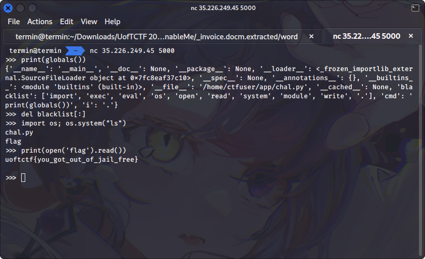

# Baby's First Pyjail

## Description
@windex told me that jails should be sourceless. So no source for you.

Author: SteakEnthusiast

`nc 35.226.249.45 5000` 

## Solution
Python jail with no source code this time. Because I don't know any restrictions or blacklists in this challenge, we can use `globals()` or `locals()`. `globals()` is a method that will show you a list of all variables that are defined in the global scope of the program, while `locals()` will show you a list of all variables that are defined in the local scope (like in function) of the program.

To use the `globals()` and return the value on the shell, I used this code

```py
print(globals())
```

From the result there's a list called blacklist that contain this value:

```
'import', 'exec', 'eval', 'os', 'open', 'read', 'system', 'module', 'write', '.'
```

As you can see, we can't called a code or command in the blacklist. Then, I remembered one of the challenge from n00bzCTF 2023 that similar to this challenge, you can read the writeup [here](../../../../2023/n00bzCTF/Misc/Big%20Blacklist/README.md). To solve this challenge we can use `del()` method to delete the value of a list. In this case, we can run this code

```py
del blacklist[:]
```

The above code will delete all elements from the list. After that you can use this code to return the list of current directory.

```py
import os; os.system("ls")
```

Flag for this challenge is in `flag` file. To show the value of flag I used this code

```py
print(open('flag').read())
```

The complete step of this challenge is in the picture



## Flag
`uoftctf{you_got_out_of_jail_free}`