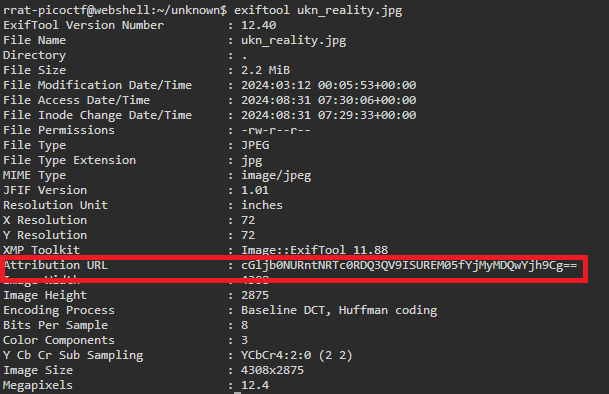
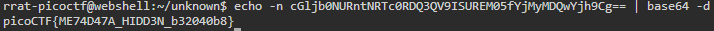

# CanYouSee

## Description
How about some hide and seek?
Download this file [here](./Challenge/unknown.zip).

## Hints
1. How can you view the information about the picture?
2. If something isn't in the expected form, maybe it deserves attention?

## Points
100

## Solution
In the zip file there's a file named `ukn_reality.jpg`. I can open the file, but as you might guess there's no flag after opening the file. First, let's check the metadata of this file by using `exiftool`.

```bash
exiftool ukn_reality.jpg
```



After checking the metadata of this file by using `exiftool` you will find a conspicuous base64 encoding in the attribution URL. Let's decode this base64 encoded data, it might lead to our flag.

```bash
echo -n cGljb0NURntNRTc0RDQ3QV9ISUREM05fYjMyMDQwYjh9Cg== | base64 -d
```



As you can see this base64 encoded data is actually the flag in this challenge.

## Flag
`picoCTF{ME74D47A_HIDD3N_b32040b8}`
