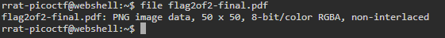
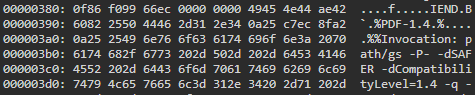
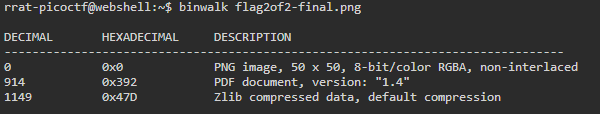
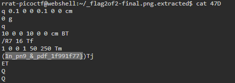

# Secret of the Polyglot

## Description
The Network Operations Center (NOC) of your local institution picked up a suspicious file, they're getting conflicting information on what type of file it is. They've brought you in as an external expert to examine the file. Can you extract all the information from this strange file?
Download the suspicious file [here](./Challenge/flag2of2-final.pdf).

## Hint
1. This problem can be solved by just opening the file in different ways

## Points
100

## Solution
The first thing to check from the attachment file is to determine the file type. To do that we can use `file` command.

```bash
file flag2of2-final.pdf
```



Using `file` command, we know that the file type of this file is png not pdf. Let's change the file extension of this file. Let's open the file.


We can see the flag by opening this file, but it's not complete. Let's find more information from this file by executing `exiftool` command to see about its metadata.

```bash
exiftool flag2of2-final.png
```

 After executing the command, my curiosity is directed to the part where there's a trailer data after PNG IEND chunk. Just for information, IEND chunk is meant as the last section of png file, it means that after IEND chunk it should be no more data. Now let's check the data or information after this IEND chunk by executing `xxd` command.

```bash
xxd flag2of2-final.png | less
```



We can see that there's a PDF file data after the IEND chunk. Maybe by using `binwalk` we can easily extract this part of data from the png file. Let's check first if we can extract the PDF data from the png file.

```bash
binwalk flag2of2-final.png
```



It seems we can extract the PDF data using `binwalk`, then let's extract the file using `binwalk`.

```bash
binwalk -e flag2of2-final.png
```

After extracting the file using `binwalk`, there are 2 files that successfully extracted. These file are `47D` and `47D.zlib`, the zlib file is the compressed version of the `47D` so we can ignore this file. Checking the file type of `47D` file and it shows as ASCII text. Let's check the content of this file.

```bash
cat 47D
```

You'll get the last part of the flag in this file.



## Flag
`picoCTF{f1u3n7_1n_pn9_&_pdf_1f991f77}`
