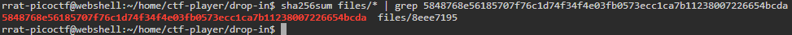
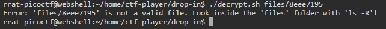
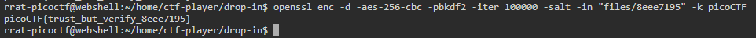

# Verify

## Description
People keep trying to trick my players with imitation flags. I want to make sure they get the real thing! I'm going to provide the SHA-256 hash and a decrypt script to help you know that my flags are legitimate.

You can download the challenge files here: <br>
[challenge.zip](./Challenge/challenge.zip)

Additional details will be available after launching your challenge instance.

**NOTE: This is an instance challenge, start the instance to get more information**

## Hints
1. Checksums let you tell if a file is complete and from the original distributor. If the hash doesn't match, it's a different file.
2. You can create a SHA checksum of a file with `sha256sum <file>` or all files in a directory with `sha256sum <directory>/*`.
3. Remember you can pipe the output of one command to another with `|`. Try practicing with the 'First Grep' challenge if you're stuck!

## Points
50

## Solution
This challenge is a practice for using `sha256sum` to check the SHA-256 hash of files for it's integrity. By using `sha256sum` we can check if the file has been modified or not.
Inside the zip files there are `checksum.txt` as a SHA-256 hash for original flag, `decrypt.sh` as a decryptor for flag file, and `files` directory that contain multiple flags.

First let's check the content of `checksum.txt` by using this command:

```sh
cat checksum.txt
```

Copy the result for filtering the correct flag in `files` directory. By using this command, we can verify all SHA-256 hash inside a directory.

```sh
sha256sum files/* | grep 5848768e56185707f76c1d74f34f4e03fb0573ecc1ca7b11238007226654bcda
```



Now we just need to decrypt the flag using `decrypt.sh`.
When starting the instance of this challenge, you will get the information of how to use the `decrypt.sh`. The command should be like this.

```sh
./decrypt.sh files/<filename>
```

But when I tried the command, it didn't work.

```sh
./decrypt.sh files/8eee7195
```



If that didn't work, let's check the source code of `decrypt.sh`.

```sh
#!/bin/bash

# Check if the user provided a file name as an argument
if [ $# -eq 0 ]; then
  echo "Expected usage: decrypt.sh <filename>"
  exit 1
fi

# Store the provided filename in a variable
file_name="$1"

# Check if the provided argument is a file and not a folder
if [ ! -f "/home/ctf-player/drop-in/$file_name" ]; then
  echo "Error: '$file_name' is not a valid file. Look inside the 'files' folder with 'ls -R'!"
  exit 1
fi

# If there's an error reading the file, print an error message
if ! openssl enc -d -aes-256-cbc -pbkdf2 -iter 100000 -salt -in "/home/ctf-player/drop-in/$file_name" -k picoCTF; then
  echo "Error: Failed to decrypt '$file_name'. This flag is fake! Keep looking!"
fi
```

From the source code, we can see the problem why the code didn't work. 
The if condition for checking the filename is a file and not a folder is the cause of this.
Because it's just checking the directory `/home/ctf-player/drop-in/$file_name`, not the current working directory and the filename. It might work if you worked on the challenge by using the SSH provided by starting the instance.
But we can reproduce the step for decrypting the flag by using this command:

```sh
openssl enc -d -aes-256-cbc -pbkdf2 -iter 100000 -salt -in "files/8eee7195" -k picoCTF
```



## Flag
`picoCTF{trust_but_verify_8eee7195}`
