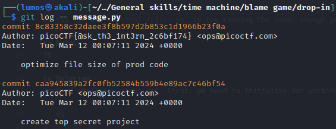

# Blame Game

## Description
Someone's commits seems to be preventing the program from working. Who is it? <br>
You can download the challenge files here: <br>
[challenge.zip](./Challenge/challenge.zip)

## Hints
1. In collaborative projects, many users can make many changes. How can you see the changes within one file?
2. Read the chapter on Git from the picoPrimer [here](https://primer.picoctf.org/#_git_version_control).
3. You can use `python3 <file>.py` to try running the code, though you won't need to for this challenge.

## Points
75

## Solution
Another challenge about git. First, we need to initialize our working git directory.

```sh
$ cd drop-in/
$ git init
```

Inside the directory there's a `message.py` file, but there's nothing about the flag.
Then we can see from hint no. 1, we need to pinpoint the commit for one file. 
To do that we can use this command:

```sh
git log -- message.py
```

Using that command, we got 2 commit changes for `message.py` and one of them is the flag that we are searching for.



## Flag
`picoCTF{@sk_th3_1nt3rn_2c6bf174}`
