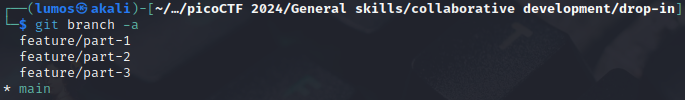
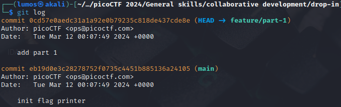
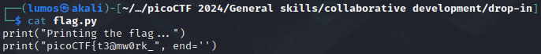
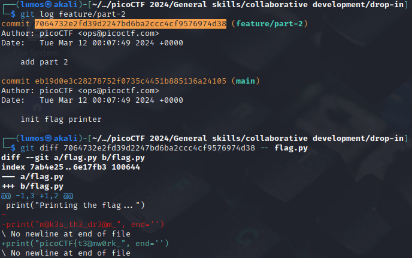
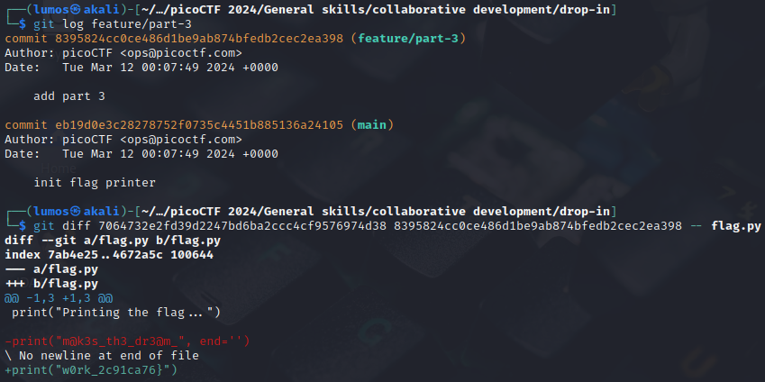

# Collaborative Development

## Description

My team has been working very hard on new features for our flag printing program! I wonder how they'll work together? <br>
You can download the challenge files here: <br>
[challenge.zip](./Challenge/challenge.zip)

## Hints
1. `git branch -a` will let you see available branches
2. How can file 'diffs' be brought to the main branch? Don't forget to `git config`!
3. Merge conflicts can be tricky! Try a text editor like nano, emacs, or vim.

## Points
75

## Solution

First we need to unzip the zip file from this challenge. Don't forget to use `git init` after unzipping the zip file, because we're working on git project.
When you see inside the directory, there's a `flag.py` to print our flag. But it seems the program is not completed yet.

If you check the commit message log using `git log` there's no other changes to the `flag.py`.
We can assume that the other commit or changes to the `flag.py` is in another branch, because we got some clue from the first hint.
Then let's check the available branches for this project using this command:

```sh
git branch -a
```



That command will show four available branches, and now we're at main branches. 
To switch to different branches we can use `git checkout`, for example if we want to switch branch `feature/part-1` then the command is like this.

```sh
git checkout feature/part-1
```

When we check the commit message of branch `feature/part-1`, we got something like this.



If we check the content of file `flag.py` it will show the part of the flag.



Or if you don't want to switching to each branches, you can use `git log` to see the commit message and get the commit id.
Then you can check the changes between branches using `git diff`.

```sh
$ git log feature/part-2
$ git diff <commit-id> -- flag.py
```



You can get the rest of the flag using the same method.



## Flag
`picoCTF{t3@mw0rk_m@k3s_th3_dr3@m_w0rk_2c91ca76}`
