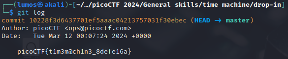

# Time Machine

## Description
What was I last working on? I remember writing a note to help me remember... <br>
You can download the challenge files here: <br>
[challenge.zip](./Challenge/challenge.zip)

## Hints
1. The `cat` command will let you read a file, but that won't help you here!
2. Read the chapter on Git from the picoPrimer [here](https://primer.picoctf.org/#_git_version_control).
3. When committing a file with git, a message can (and should) be included.

## Points
50

## Solution
This challenge is about git and the guide from picoPrimer is really help to solve this challenge.
So if you're not familiar with git, please spend a little bit of your time to read the guide from picoPrimer, because it will help you to learn about git and not only to solve this challenge.

Okay, now time to solve this challenge. You will receive a zip file and when you unzip that file there will be `drop-in` directory.
Go to that directory. Inside that directory there's a file, but that file is not the flag.
First we need to initialize this directory using `git init` command. That command is needed if you're starting your work on git directories.

```sh
git init
```

After initializing the directory, we can check the commit message because the hint give a direct clue where's the flag.
To check the commit message, we can use this command:

```sh
git log
```



As you can see from the image above, the flag is literally in git commit message

## Flag
`picoCTF{t1m3m@ch1n3_8defe16a}`
