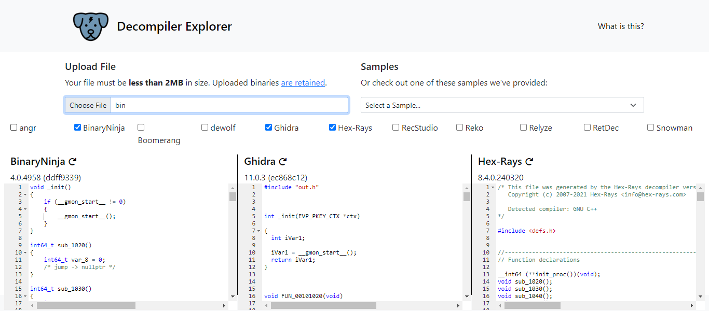

# FactCheck

## Description
This binary is putting together some important piece of information... Can you uncover that information? <br>
Examine this [file](./Challenge/bin). Do you understand its inner workings?

## Points
200

## Solution
For this challenge we need to use decompiler tool to decompile the binary file. But, honestly I don't know how to use decompiler tool like IDA or Ghidra.
So for this challenge I use [dogbolt.org](https://dogbolt.org/) to decompile the binary file. 
Using dogbolt, we can choose any decompiler we want to decompile the binary file. In this example, I choose BinaryNinja, Ghidra, and Hex-Rays.



From the decompiled result, we will look at the main function. From the 3 decompiler, I somehow understand the output from Ghidran and Hex-Rays.
This is the decompiled result from Ghidra, I will just focus on the important part.

```
undefined8 main(void)

{
  char cVar1;
  char *pcVar2;
  long in_FS_OFFSET;
  # output snipped
  long local_20;

  local_20 = *(long *)(in_FS_OFFSET + 0x28);
  std::allocator<char>::allocator();
                    // try { // try from 001012cf to 001012d3 has its CatchHandler @ 00101975
  std::__cxx11::basic_string<char,std::char_traits<char>,std::allocator<char>>::basic_string
            ((char *)local_248,(allocator *)"picoCTF{wELF_d0N3_mate_");
  std::allocator<char>::~allocator(&local_249);
  std::allocator<char>::allocator();
                    // try { // try from 0010130a to 0010130e has its CatchHandler @ 00101996
  std::__cxx11::basic_string<char,std::char_traits<char>,std::allocator<char>>::basic_string
            ((char *)local_228,(allocator *)&DAT_0010201d);
  std::allocator<char>::~allocator(&local_249);
  std::allocator<char>::allocator();
                    // try { // try from 00101345 to 00101349 has its CatchHandler @ 001019b1
  std::__cxx11::basic_string<char,std::char_traits<char>,std::allocator<char>>::basic_string
            ((char *)local_208,(allocator *)&DAT_0010201d);
  std::allocator<char>::~allocator(&local_249);
  std::allocator<char>::allocator();
                    // try { // try from 00101380 to 00101384 has its CatchHandler @ 001019cc
  std::__cxx11::basic_string<char,std::char_traits<char>,std::allocator<char>>::basic_string
            ((char *)local_1e8,(allocator *)&DAT_0010201f);
  std::allocator<char>::~allocator(&local_249);
  std::allocator<char>::allocator();
                    // try { // try from 001013bb to 001013bf has its CatchHandler @ 001019e7
  std::__cxx11::basic_string<char,std::char_traits<char>,std::allocator<char>>::basic_string
            ((char *)local_1c8,(allocator *)&DAT_00102021);
  std::allocator<char>::~allocator(&local_249);
  std::allocator<char>::allocator();
                    // try { // try from 001013f6 to 001013fa has its CatchHandler @ 00101a02
  std::__cxx11::basic_string<char,std::char_traits<char>,std::allocator<char>>::basic_string
            ((char *)local_1a8,(allocator *)&DAT_00102023);
  std::allocator<char>::~allocator(&local_249);
  std::allocator<char>::allocator();
                    // try { // try from 00101431 to 00101435 has its CatchHandler @ 00101a1d
  std::__cxx11::basic_string<char,std::char_traits<char>,std::allocator<char>>::basic_string
            ((char *)local_188,(allocator *)&DAT_0010201d);
  std::allocator<char>::~allocator(&local_249);
  std::allocator<char>::allocator();
                    // try { // try from 0010146c to 00101470 has its CatchHandler @ 00101a38
  std::__cxx11::basic_string<char,std::char_traits<char>,std::allocator<char>>::basic_string
            ((char *)local_168,(allocator *)&DAT_00102025);
  std::allocator<char>::~allocator(&local_249);
  std::allocator<char>::allocator();
                    // try { // try from 001014a7 to 001014ab has its CatchHandler @ 00101a53
  std::__cxx11::basic_string<char,std::char_traits<char>,std::allocator<char>>::basic_string
            ((char *)local_148,(allocator *)&DAT_00102027);
  std::allocator<char>::~allocator(&local_249);
  std::allocator<char>::allocator();
                    // try { // try from 001014e2 to 001014e6 has its CatchHandler @ 00101a6e
  std::__cxx11::basic_string<char,std::char_traits<char>,std::allocator<char>>::basic_string
            ((char *)local_128,(allocator *)&DAT_00102029);
  std::allocator<char>::~allocator(&local_249);
  std::allocator<char>::allocator();
                    // try { // try from 0010151d to 00101521 has its CatchHandler @ 00101a89
  std::__cxx11::basic_string<char,std::char_traits<char>,std::allocator<char>>::basic_string
            ((char *)local_108,(allocator *)&DAT_0010202b);
  std::allocator<char>::~allocator(&local_249);
  std::allocator<char>::allocator();
                    // try { // try from 00101558 to 0010155c has its CatchHandler @ 00101aa4
  std::__cxx11::basic_string<char,std::char_traits<char>,std::allocator<char>>::basic_string
            ((char *)local_e8,(allocator *)&DAT_0010202d);
  std::allocator<char>::~allocator(&local_249);
  std::allocator<char>::allocator();
                    // try { // try from 00101593 to 00101597 has its CatchHandler @ 00101abf
  std::__cxx11::basic_string<char,std::char_traits<char>,std::allocator<char>>::basic_string
            ((char *)local_c8,(allocator *)&DAT_0010202f);
  std::allocator<char>::~allocator(&local_249);
  std::allocator<char>::allocator();
                    // try { // try from 001015ce to 001015d2 has its CatchHandler @ 00101ada
  std::__cxx11::basic_string<char,std::char_traits<char>,std::allocator<char>>::basic_string
            ((char *)local_a8,(allocator *)&DAT_00102031);
  std::allocator<char>::~allocator(&local_249);
  std::allocator<char>::allocator();
                    // try { // try from 00101606 to 0010160a has its CatchHandler @ 00101af5
  std::__cxx11::basic_string<char,std::char_traits<char>,std::allocator<char>>::basic_string
            ((char *)local_88,(allocator *)&DAT_0010202b);
  std::allocator<char>::~allocator(&local_249);
  std::allocator<char>::allocator();
                    // try { // try from 0010163e to 00101642 has its CatchHandler @ 00101b0d
  std::__cxx11::basic_string<char,std::char_traits<char>,std::allocator<char>>::basic_string
            ((char *)local_68,(allocator *)&DAT_0010201f);
  std::allocator<char>::~allocator(&local_249);
  std::allocator<char>::allocator();
                    // try { // try from 00101676 to 0010167a has its CatchHandler @ 00101b25
  std::__cxx11::basic_string<char,std::char_traits<char>,std::allocator<char>>::basic_string
            ((char *)local_48,(allocator *)&DAT_00102033);
  std::allocator<char>::~allocator(&local_249);
                    // try { // try from 00101699 to 0010185f has its CatchHandler @ 00101b3d
  pcVar2 = (char *)std::__cxx11::basic_string<char,std::char_traits<char>,std::allocator<char>>::
                   operator[]((ulong)local_208);
  if (*pcVar2 < 'B') {
    std::__cxx11::basic_string<char,std::char_traits<char>,std::allocator<char>>::operator+=
              (local_248,local_c8);
  }
  pcVar2 = (char *)std::__cxx11::basic_string<char,std::char_traits<char>,std::allocator<char>>::
                   operator[]((ulong)local_a8);
  if (*pcVar2 != 'A') {
    std::__cxx11::basic_string<char,std::char_traits<char>,std::allocator<char>>::operator+=
              (local_248,local_68);
  }
  pcVar2 = (char *)std::__cxx11::basic_string<char,std::char_traits<char>,std::allocator<char>>::
                   operator[]((ulong)local_1c8);
  cVar1 = *pcVar2;
  pcVar2 = (char *)std::__cxx11::basic_string<char,std::char_traits<char>,std::allocator<char>>::
                   operator[]((ulong)local_148);
  if ((int)cVar1 - (int)*pcVar2 == 3) {
    std::__cxx11::basic_string<char,std::char_traits<char>,std::allocator<char>>::operator+=
              (local_248,local_1c8);
  }
  std::__cxx11::basic_string<char,std::char_traits<char>,std::allocator<char>>::operator+=
            (local_248,local_1e8);
  std::__cxx11::basic_string<char,std::char_traits<char>,std::allocator<char>>::operator+=
            (local_248,local_188);
  pcVar2 = (char *)std::__cxx11::basic_string<char,std::char_traits<char>,std::allocator<char>>::
                   operator[]((ulong)local_168);
  if (*pcVar2 == 'G') {
    std::__cxx11::basic_string<char,std::char_traits<char>,std::allocator<char>>::operator+=
              (local_248,local_168);
  }
  std::__cxx11::basic_string<char,std::char_traits<char>,std::allocator<char>>::operator+=
            (local_248,local_1a8);
  std::__cxx11::basic_string<char,std::char_traits<char>,std::allocator<char>>::operator+=
            (local_248,local_88);
  std::__cxx11::basic_string<char,std::char_traits<char>,std::allocator<char>>::operator+=
            (local_248,local_228);
  std::__cxx11::basic_string<char,std::char_traits<char>,std::allocator<char>>::operator+=
            (local_248,local_128);
  std::__cxx11::basic_string<char,std::char_traits<char>,std::allocator<char>>::operator+=
            (local_248,'}');
  std::__cxx11::basic_string<char,std::char_traits<char>,std::allocator<char>>::~basic_string
            (local_48);
  # output snipped
```

From the decompiled result of Ghidra, we can summarize the logic of the binary file:
1. There's first part of the flag that is saved in `local_20` variable.
2. There are initialization value of multiple variables. This variable will be use for the next operation.
3. There are parameter check using if condition.
4. There are append like operation to add the value for the final flag.

The decompiled resut from Ghidra is bit hard to read. But, when we add the decompiled result from Hex-Rays we can implement the operation for displaying the flag.
This is rhe decompiled result from Hex-Rays.

```
int __fastcall main(int argc, const char **argv, const char **envp)
{
  # output snipped
  v39 = __readfsqword(0x28u);
  std::allocator<char>::allocator(&v21, argv, envp);
  std::string::basic_string(v22, "picoCTF{wELF_d0N3_mate_", &v21);
  std::allocator<char>::~allocator(&v21);
  std::allocator<char>::allocator(&v21, "picoCTF{wELF_d0N3_mate_", v3);
  std::string::basic_string(v23, "5", &v21);
  std::allocator<char>::~allocator(&v21);
  std::allocator<char>::allocator(&v21, "5", v4);
  std::string::basic_string(v24, "5", &v21);
  std::allocator<char>::~allocator(&v21);
  std::allocator<char>::allocator(&v21, "5", v5);
  std::string::basic_string(v25, "7", &v21);
  std::allocator<char>::~allocator(&v21);
  std::allocator<char>::allocator(&v21, "7", v6);
  std::string::basic_string(v26, "3", &v21);
  std::allocator<char>::~allocator(&v21);
  std::allocator<char>::allocator(&v21, "3", v7);
  std::string::basic_string(v27, "0", &v21);
  std::allocator<char>::~allocator(&v21);
  std::allocator<char>::allocator(&v21, "0", v8);
  std::string::basic_string(v28, "5", &v21);
  std::allocator<char>::~allocator(&v21);
  std::allocator<char>::allocator(&v21, "5", v9);
  std::string::basic_string(v29, "a", &v21);
  std::allocator<char>::~allocator(&v21);
  std::allocator<char>::allocator(&v21, "a", v10);
  std::string::basic_string(v30, "e", &v21);
  std::allocator<char>::~allocator(&v21);
  std::allocator<char>::allocator(&v21, "e", v11);
  std::string::basic_string(v31, "f", &v21);
  std::allocator<char>::~allocator(&v21);
  std::allocator<char>::allocator(&v21, "f", v12);
  std::string::basic_string(v32, "d", &v21);
  std::allocator<char>::~allocator(&v21);
  std::allocator<char>::allocator(&v21, "d", v13);
  std::string::basic_string(v33, "b", &v21);
  std::allocator<char>::~allocator(&v21);
  std::allocator<char>::allocator(&v21, "b", v14);
  std::string::basic_string(v34, "9", &v21);
  std::allocator<char>::~allocator(&v21);
  std::allocator<char>::allocator(&v21, "9", v15);
  std::string::basic_string(v35, "6", &v21);
  std::allocator<char>::~allocator(&v21);
  std::allocator<char>::allocator(&v21, "6", v16);
  std::string::basic_string(v36, "d", &v21);
  std::allocator<char>::~allocator(&v21);
  std::allocator<char>::allocator(&v21, "d", v17);
  std::string::basic_string(v37, "7", &v21);
  std::allocator<char>::~allocator(&v21);
  std::allocator<char>::allocator(&v21, "7", v18);
  std::string::basic_string(v38, "8", &v21);
  std::allocator<char>::~allocator(&v21);
  if ( *(char *)std::string::operator[](v24, 0LL) <= 65 )
    std::string::operator+=(v22, v34);
  if ( *(_BYTE *)std::string::operator[](v35, 0LL) != 65 )
    std::string::operator+=(v22, v37);
  if ( "Hello" == "World" )
    std::string::operator+=(v22, v25);
  v19 = *(char *)std::string::operator[](v26, 0LL);
  if ( v19 - *(char *)std::string::operator[](v30, 0LL) == 3 )
    std::string::operator+=(v22, v26);
  std::string::operator+=(v22, v25);
  std::string::operator+=(v22, v28);
  if ( *(_BYTE *)std::string::operator[](v29, 0LL) == 71 )
    std::string::operator+=(v22, v29);
  std::string::operator+=(v22, v27);
  std::string::operator+=(v22, v36);
  std::string::operator+=(v22, v23);
  std::string::operator+=(v22, v31);
  std::string::operator+=(v22, 125LL);
  # output snipped
```

From the Hex-Rays output we can complement the operation for displaying flag based on Ghidra output:
1. First part of the flag is saved on v22 variable.
2. If variable v24 is lower or equal than 65 ('A' in ASCII), then the value of v22 will be added with the value of v34.
3. If variable v35 is not equal to 65, then the value of v22 will be added with the value of v37.
4. If string "Hello" is equal to "World", then the value of v22 will be added with the value of v25.
5. Assign the value of v26 to v19 variable.
6. If the value of v19 - v30 is equal to 3, then the value of v22 will be added with the value of v26.
7. Add the value of v22 with the value of v25.
8. Add the value of v22 with the value of v28.
9. If the value of v29 is equal to 71 ('G' in ASCII), then the value of v22 will be added with the value of v29.
10. Add the value of v22 with the value of v27.
11. Add the value of v22 with the value of v36.
12. Add the value of v22 with the value of v23.
13. Add the value of v22 with the value of v31.
14. Add the value of v22 with the decimal value of 125 ('}' in ASCII).

We can create the similar operation for displaying the flag using Python.
This is the Python code to displaying the flag.

```py
v22 = 'picoCTF{wELF_d0N3_mate_'
v23 = '5'
v24 = '5'
v25 = '7'
v26 = '3'
v27 = '0'
v28 = '5'
v29 = 'a'
v30 = 'e'
v31 = 'f'
v32 = 'd'
v33 = 'b'
v34 = '9'
v35 = '6'
v36 = 'd'
v37 = '7'
v38 = '8'

if(ord(v24) <= 65):
    v22 += v34
if(ord(v35) != 65):
    v22 += v37
if("Hello" == "World"):
    v22 +=v25

v19 = v26

if(ord(v19) - ord(v30) == 3):
    v22 += v26

v22 += v25
v22 += v28

if(ord(v29) == 71):
    v22 += v29

v22 += v27
v22 += v36
v22 += v23
v22 += v31
v22 += chr(125)

print(v22)
```

## Flag
`picoCTF{wELF_d0N3_mate_97750d5f}`
