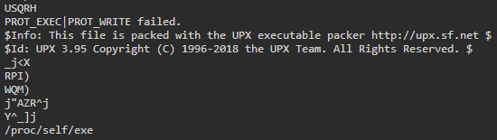
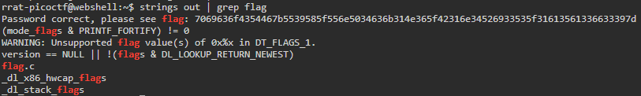

# packer

## Description
Reverse this linux executable?

[binary](./Challenge/out)

## Hints
1. What can we do to reduce the size of a binary after compiling it.

## Points
100

## Solution
We were given a binary file and from the hint we know that this binary file has been compressed to reduce it size.
To check the method or tool that has been used to compressed the binary file, we can check using `strings` command.

```sh
strings out | less
```

If you look closely, you will found that the binary file has been compressed or packed using UPX.



To decompress the binary file, we can use UPX. This is the command to decompress the file.

```sh
upx -d out
```

After decompressed the binary file, we can check again for any printable characters in this binary file using `strings` command.
To make the observation easier and faster, we can use `grep` to filtering the output. For example we will filter any printable characters that contain flag.

```sh
strings out | grep flag
```



From the image above, we can see the flag for this challenge is encoded using hex.
To decode the hex value we can use this command.

```sh
echo 7069636f4354467b5539585f556e5034636b314e365f42316e34526933535f31613561336633397d | xxd -r -p
```

## Flag
`picoCTF{U9X_UnP4ck1N6_B1n4Ri3S_1a5a3f39}`
