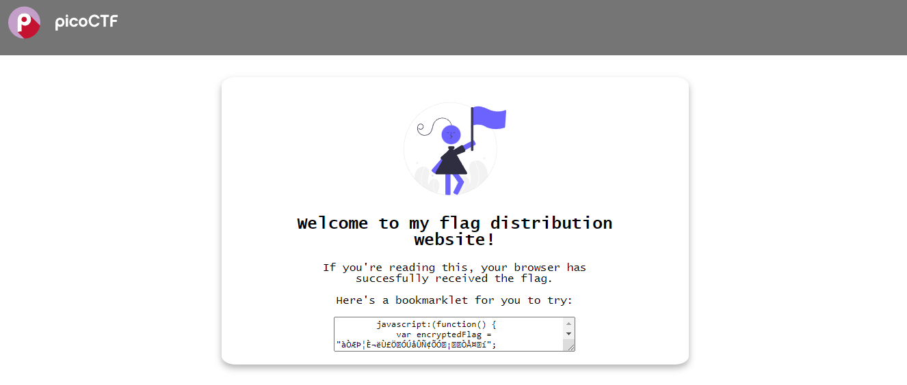
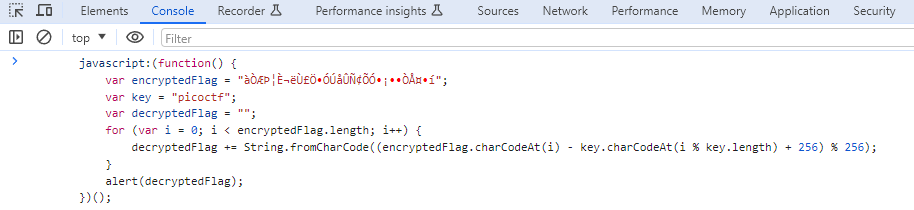

# Bookmarklet

## Description
Why search for the flag when I can make a bookmarklet to print it for me?
 
Additional details will be available after launching your challenge instance.

**NOTE: This is an instance challenge, start the instance to get more information**

## Hints
1. A bookmarklet is a bookmark that runs JavaScript instead of loading a webpage.
2. What happens when you click a bookmarklet?
3. Web browsers have other ways to run JavaScript too.

## Points
50

## Solution
When we open the webpage we got some Javascript program inside a text box.

To run the Javascript program we can use browser developer console.
To open the developer console in Chromium based web browser, press `Ctrl + Shift + C` and then choose `Console` tab.
Copy paste the program from the webpage to developer console and then press Enter.

The flag will be printed on web browser alert.

The Javascript program will run these following steps:
1. Initialize the value for encrypted flag.
2. Initialize the key for the decrypting the encrypted flag, which is the value is `picoctf`.
3. Run iteration with maximum iteration is the character length of encrypted flag.
4. For each iteration it will get the value of each unicode characters of encrypted flag. Then each unicode characters of decrypted flag will be subtracted from unicode of characters of key that have been modulo by the length of the key. Those value will be added by 256 and after that will be mod by 256.
5. Save each iteration to decrypted flag.
6. Print the decrypted flag into browser alert.

## Flag
`picoCTF{p@g3_turn3r_0148cb05}`

