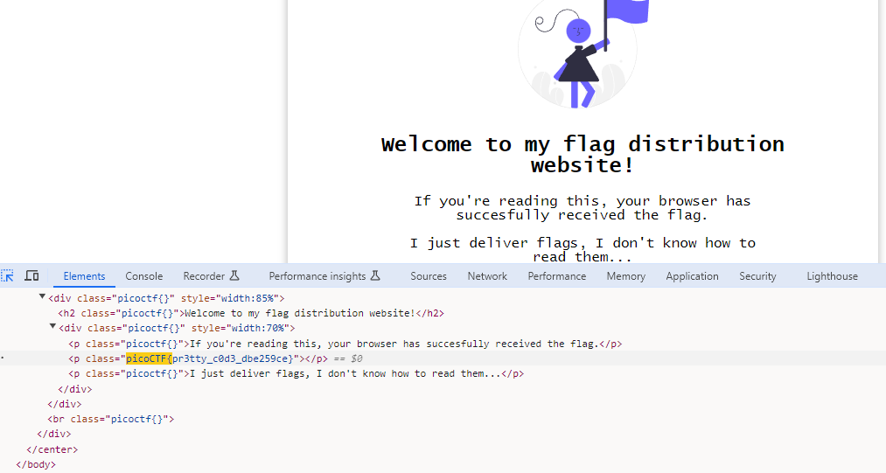

# Unminify

## Description
I don't like scrolling down to read the code of my website, so I've squished it. As a bonus, my pages load faster!  
Additional details will be available after launching your challenge instance.

**NOTE: This is an instance challenge, start the instance to get more information**

## Hints
1. Try CTRL+U / ⌘+U in your browser to view the page source. You can also add 'view-source:' before the URL, or try curl `<URL>` in your shell.
2. Minification reduces the size of code, but does not change its functionality.
3. What tools do developers use when working on a website? Many text editors and browsers include formatting.

## Points
100

## Solution
To solve this challenge you can use similar approach of using inspect element or view source code of webpage like the previous challenge [WebDecode](https://github.com/n1mdacybersec/CTF-Write-Up-Collection/tree/main/2024/picoCTF/Web%20Exploitation/WebDecode).
First, open the inspect element. Then search in the source code of the webpage using `picoCTF{` pattern.
You'll find the similar result like this image.

## Flag
`picoCTF{pr3tty_c0d3_dbe259ce}`
