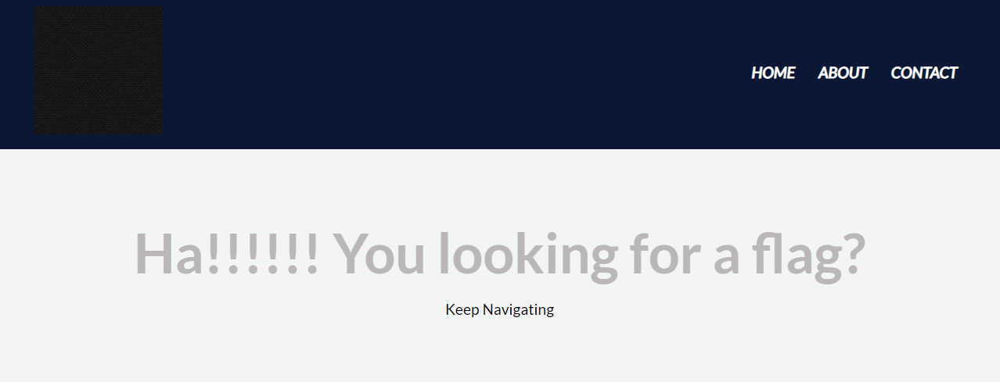
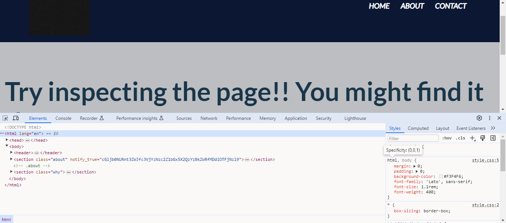

# WebDecode

## Description

Do you know how to use the web inspector?  
Additional details will be available after launching your challenge instance.

**NOTE: This is an instance challenge, start the instance to get more information**

## Hints
1. Use the web inspector on other files included by the web page.
2. The flag may or may not be encoded

## Points
50

## Solution
Let's take a look at the webpage for this challenge. The webpage consist of Home page, About and Contant page.

Because the main goal of this challenge is how to use the web inspector or inspect element from web page, let's check the Home page first.
After checking the source code of Home page using inspect element, there're no other clues regarding the flag.

Then let's check the About page. In this page, there's something strange from the `notify_true` attribute in `section` tag.
It's seems the value of this `notify_true` is encoded using base64.

After decoding the value of `notify_true` using [Cyberchef](https://gchq.github.io/CyberChef/) we will get the flag for this challenge.

## Flag
`picoCTF{web_succ3ssfully_d3c0ded_07b91c79}`
