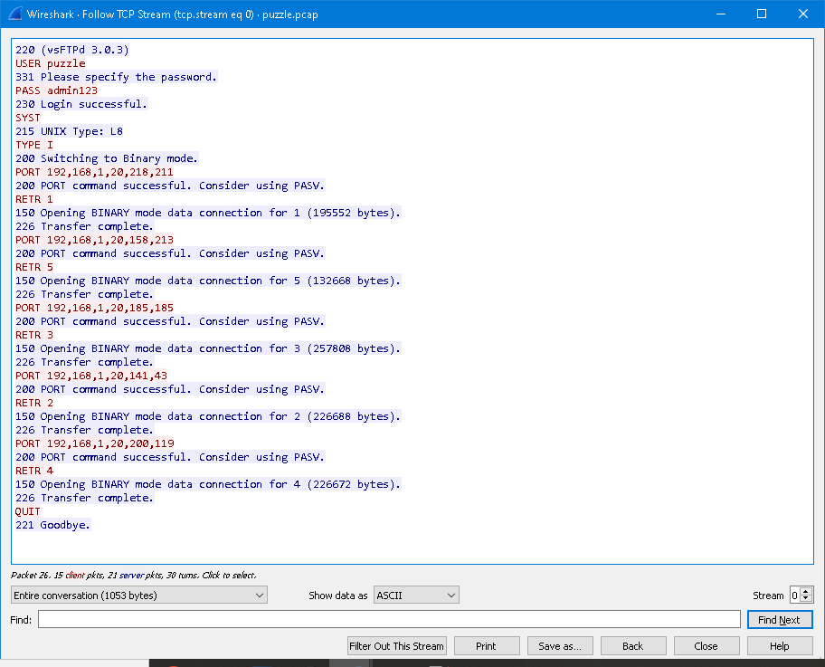
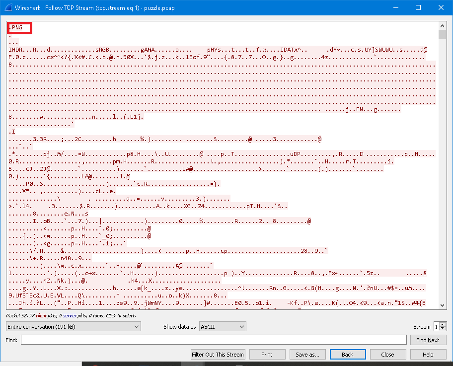
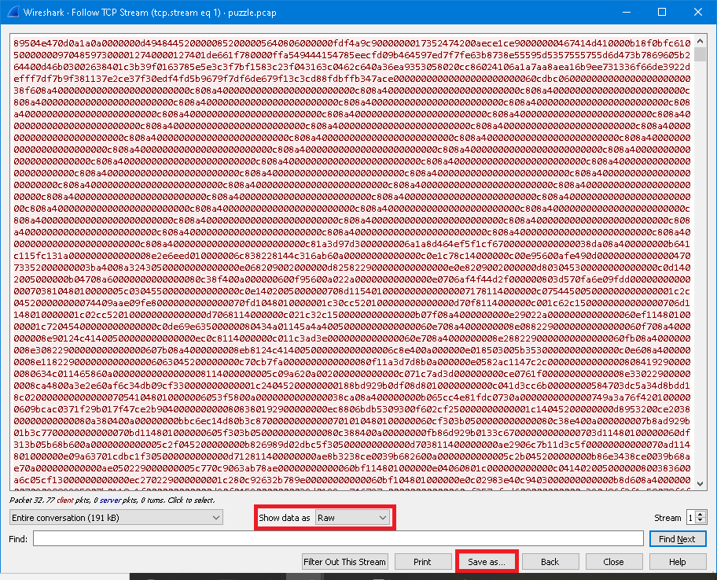
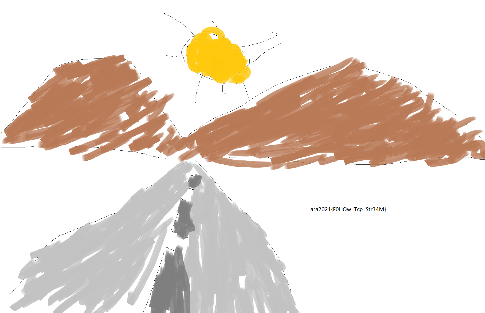

# PUZZLE

## Deskripsi
Kamu disuruh untuk mencari tahu file file yang berhasil diambil oleh Hacker dimana file-file tersebut jika disusun akan membentuk sebuah gambar yang berisikan flag rahasia. Temukan dan kamu berkesempatan untuk terpilih menjadi Blue Team di Telkom Indonesia

## Solusi
Soal yang diberikan berupa sebuah file PCAP. Dalam deskripsi soal disebutkan bahwa terdapat file-file yang telah diambil oleh Hacker dan kita harus menyusun file tersebut untuk mendapatkan flag.
Karena packet yang di-capture berupa beberapa packet TCP dan FTP, maka lebih mudah untuk melihat packet-packet tersebut dengan Follow TCP Stream.

Dari stream pertama terlihat bahwa terdapat operasi untuk mendownload file 1, 5, 3, 2, dan 4.


Kemudian jika dilihat pada stream kedua, terlihat gambar yang didownload berupa file PNG. Dalam [Wikipedia](https://en.wikipedia.org/wiki/List_of_file_signatures) disebutkan file signature yang terdapat pada stream mirip dengan file signature PNG.


Langkah selanjutnya adalah untuk menyimpan stream nomor 1 sampai 5 ke dalam format raw data. Berikan nama sesuai urutan file yang didownload sehingga lebih mudah untuk menyatukan file tersebut.


Karena file sudah didapatkan, kita dapat menggunakan program Python berikut untuk menyusun kembali file-file tersebut dan menyimpannya menjadi file PNG
```
content =""
data = ["1.raw", "2.raw", "3.raw", "4.raw", "5.raw"] 
for file in data: 
    with open(str(file), 'rb') as f:  
        content += f.read().hex()
content = bytes.fromhex(content) 
with open("result.png",'wb') as f: 
    file.write(content)
```

Hasilnya didapatkan gambar yang terdapat flag didalamnya


## Flag
### ara2021{F0LlOw_Tcp_Str34M}

