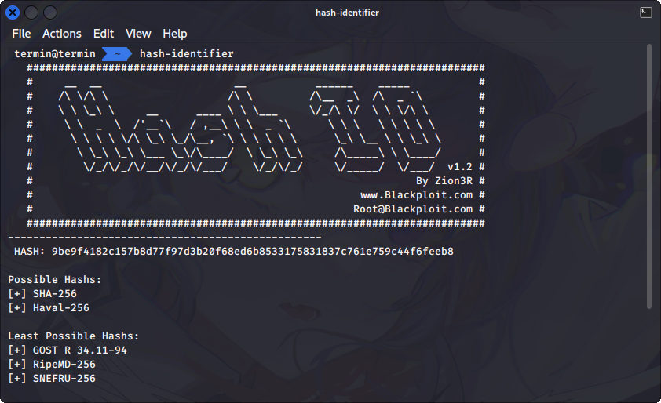

# SH4-32

## Deskripsi
Sze received an ecnrypted file and a message containing the clue of the file password from her friend.

The clue was a hash value : 9be9f4182c157b8d77f97d3b20f68ed6b8533175831837c761e759c44f6feeb8

Decrypt the file password!

[Attachment](./Challenge/Dictionary.txt)

## Solusi
Langkah pertama adalah menentukan jenis hash yang digunakan, dengan menggunakan hash-identifier

```shell
hash-identifier
```



Langkah selanjutnya digunakan hashcat untuk melakukan dictionary attack terhadap hash tersebut.

```shell
hashcat -m 1400 -a 0 "9be9f4182c157b8d77f97d3b20f68ed6b8533175831837c761e759c44f6feeb8" Dictionary.txt
```

Karena tidak ditemukan hash yang sesuai, namun terdapat potfile. Digunakan --show untuk menunjukkan nilainya.

```shell
$ hashcat -m 1400 -a 0 "9be9f4182c157b8d77f97d3b20f68ed6b8533175831837c761e759c44f6feeb8" Dictionary.txt --show
9be9f4182c157b8d77f97d3b20f68ed6b8533175831837c761e759c44f6feeb8:415241323032337b6834736833645f30525f6e4f545f6834736833647d
```
`415241323032337b6834736833645f30525f6e4f545f6834736833647d` terlihat seperti hex code. Saat dicoba untuk decode didapatkan hasil berikut

```shell
$ echo 415241323032337b6834736833645f30525f6e4f545f6834736833647d | xxd -r -p
ARA2023{h4sh3d_0R_nOT_h4sh3d}
```

### Solusi Alternatif
Ternyata di dalam file `Dictionary.txt` terdapat list dictionary yang cukup mencurigakan dan berbeda dengan list dictionary yang lainnya. 


Ternyata merupakan hex code, jika di decode didapatkan.

```shell
$ echo 415241323032337b6834736833645f30525f6e4f545f6834736833647d | xxd -r -p
ARA2023{h4sh3d_0R_nOT_h4sh3d}
```

## Flag
### ARA2023{h4sh3d_0R_nOT_h4sh3d}

