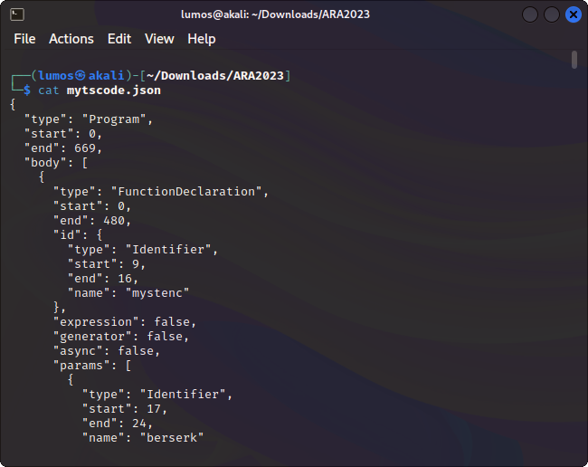

# Vidner's Rhapsody

## Deskripsi
Once I was going to send you the program, but do me a favor by retrieving the real output of the program from this generated JSON program tree. Can you?

[Attachments](./Challenge/mytscode.json)

## Solusi
Soal yang diberikan berupa file JSON yang jika dilihat seperti struktur program. Jadi file JSON tersebut merupakan AST (Abstract Syntax Tree) yang merupakan penulisan struktur dari program asli dalam bentuk tree.



Karena malas untuk melakukan representasi dari JSON tersebut ke program secara manual, maka dicari cara lain untuk membuat AST tersebut menjadi source code program secara lebih cepat dan efisien. Ditemukan cara yang lebih cepat yaitu dengan menggunakan [escodegen](https://github.com/estools/escodegen/tree/master). Dengan menggunakan escodegen tersebut AST akan otomatis ditranslate menjadi Javascript source code.

Cara menggunakannya cukup mudah, seperti pada program di bawah ini

```js
const fs = require('fs')
const escodegen = require('escodegen')

let file = fs.readFileSync('mytscode.json')
let parser = JSON.parse(file)
console.log(escodegen.generate(parser));
```

Saat menjalankan program tersebut akan didapatkan source codenya.
```js
function mystenc(berserk, guts) {
    var s = [], j = 0, x, res = '';
    for (var i = 0; i < 256; i++) {
        s[i] = i;
    }
    for (i = 0; i < 256; i++) {
        j = (j + s[i] + berserk.charCodeAt(i % berserk.length)) % 256;
        x = s[i];
        s[i] = s[j];
        s[j] = x;
    }
    i = 0;
    j = 0;
    for (var y = 0; y < guts.length; y++) {
        i = (i + 1) % 256;
        j = (j + s[i]) % 256;
        x = s[i];
        s[i] = s[j];
        s[j] = x;
        res += String.fromCharCode(guts[y] ^ s[(s[i] + s[j]) % 256]);
    }
    console.log(res);
}
var berserk = 'achenk';
var strenk = [
    244,
    56,
    117,
    247,
    61,
    16,
    3,
    64,
    107,
    57,
    131,
    13,
    137,
    113,
    214,
    238,
    178,
    199,
    4,
    115,
    235,
    139,
    201,
    22,
    164,
    132,
    175
];
mystenc(berserk, strenk);
```

Source code tersebut disimpan sebagai file .js dan ketika dijalankan akan didapatkan hasil seperti berikut.


## Flag
### ARA2023{j4vAST_l!ke_84831_t0wer_lol}
