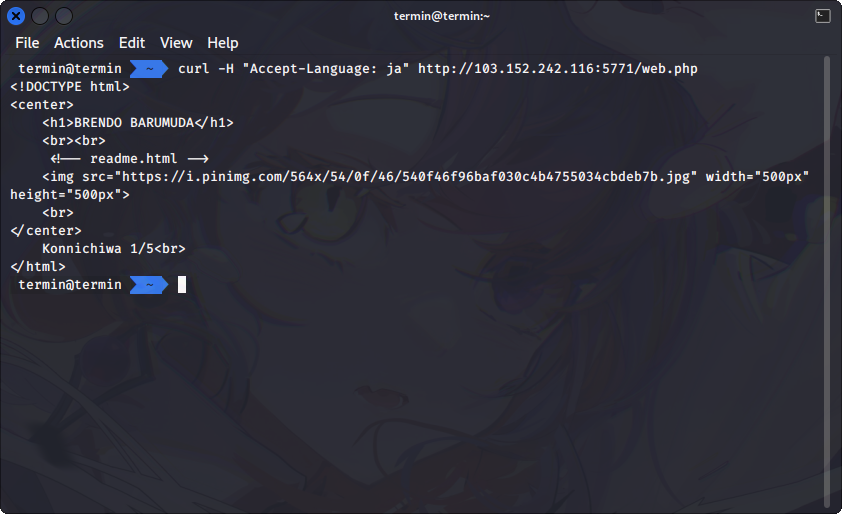
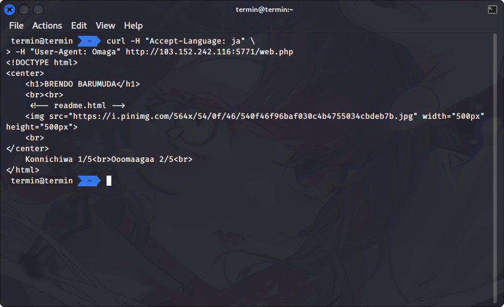

# X-is for blabla

## Deskripsi
Recently my friend was buy helmet called RFC 2616, pretty strange huh?

http://103.152.242.116:5771/web.php

## Hint
- [This maybe Help you](https://developer.mozilla.org/en-US/docs/Web/HTTP/Headers)
- Readme is important. Are you ever heard about a json cookie?

## Solusi
Saat mengunjungi halaman tersebut dan melihat source codenya terdapat petunjuk yang bisa digunakan untuk menyelesaikan challenge.


Isi dari readme.html seperti berikut ini
```
Brendo merupakan youtuber mukbang dari Jepang.

Brendo setiap mengupload video youtube nya menggunakan browser yang hits yaitu Omaga.

Tentunya di laptop/komputer Brendo menggunakan sistem operasi Wengdows agar bisa bekerja secara produktif.

Ohh ya, akhir - akhir banyak kasus stalker kepada youtuber di Jepang, oleh karena itu Brendo tidak suka diikuti oleh stalker.

Biasanya, setelah melakukan streaming Brendo selalu membeli Kue yang berada di dekat rumahnya.
Tempat toko kue tersebut ada di jalan No. 1337, selain kue dari toko tersebut enak ada alasan lain Brendo sering membeli kue di tempat tersebut.
Itu karena sang penjaga toko adalah perempuan cantik bernama Araa, oleh karena itu Brendo mencoba mendekati perempuan tersebut untuk menjadi pacarnya.
```

Dari readme.html tersebut ada beberapa parameter yang harus diatur agar bisa mendapatkan flag:
1. Mengubah bahasa untuk mengakses halaman http://103.152.242.116:5771/web.php menjadi bahasa Jepang
2. Mengubah browser menjadi Omaga
3. Mengatur operating system yang digunakan menjadi Wengdows
4. Mengaktifkan fitur “Do Not Track”
5. Mengatur cookie dengan nama Kue

Untuk langkah pertama dengan mengatur header `Accept-Language: ja` untuk mengubah preferensi bahasa menjadi bahasa Jepang. Pada response akan didapatkan progres yang telah kita dapat.



Langkah berikutnya adalah mengatur browser yang digunakan menjadi Omaga, yaitu caranya dengan menggunakan header `User-Agent: Omaga`. Progres berikutnya yang didapat seperti berikut.



Langkah yang ketiga adalah memberitahu browser bahwa kita menggunakan operating system Wengdows, yaitu dengan cara mengatur header `Sec-CH-UA-Platform: Wengdows`. Progres yang ketiga terlihat seperti berikut.


Di langkah yang keempat kita diberitahu bahwa Brendo tidak suka stalker, maka dari itu kita perlu mengatur header `DNT: 1` di browser atau bisa dengan membukanya pada Incognito mode di chromium based browser atau Private mode di Firefox browser. Progres yang keempat seperti berikut ini.


Untuk langkah yang terakhir terdapat Cookie yang menarik perhatian dari readme.html, yaitu Cookie Kue, No. 1337, dan Araa. Namun beberapa cara yang telah dicoba masih salah. Ternyata Cookie yang harus diset adalah Kue dengan nilai dari dua cookie yang telah di base64. Digunakan perintah berikut untuk membuat cookie di encode menjadi base64.
``` shell
echo -n '{"no":"1337","nama":"Araa"}' | base64
```

Hasil dari encoding 2 cookie tersebut didapatkan base64 dengan nilai `eyJubyI6IjEzMzciLCJuYW1hIjoiQXJhYSJ9`. Nilai base64 itu dimasukkan ke dalam header `Cookie: Kue=eyJubyI6IjEzMzciLCJuYW1hIjoiQXJhYSJ9`. Hasilnya didapatkan flag pada response body.


Kondisi ketika cari nilai cookie yang bener:


## Flag
### ARA2023{H3ad_1s_ImP0rt4Nt}
