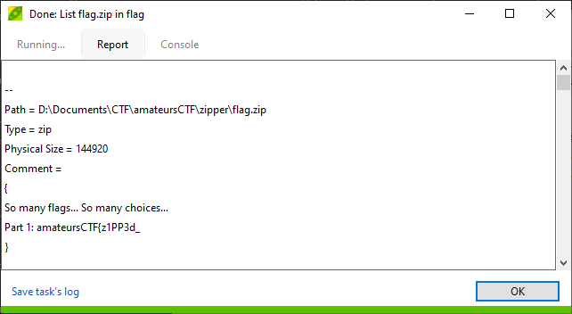
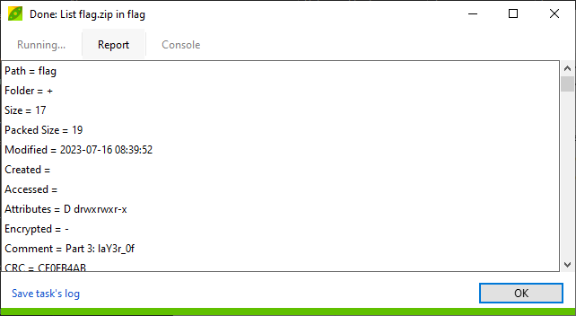

# zipper

## Deskripsi
Stare into the zip and the zip stares back.

## Attachment
[flag.zip](./Challenge/flag.zip)

## Solusi
Diberikan sebuah file zip dan jika dibuka menggunakan [PeaZip](https://peazip.github.io/) terdapat nama direktori yang sama, yaitu `flag` namun memiliki created / modified date yang berbeda.


Selanjutnya dicoba untuk melihat informasi mengenai metadata dan informasi detail lain mengenai file zip ini. Caranya pada PeaZip, klik kanan pada salah satu direktori `flag`, pilih More > List > List all.
Bagian pertama dari flag ditemukan pada bagian Comment.



Selanjutnya bagian ketiga dari flag ada pada Comment untuk direktori `flag`.

.

Sejauh ini sudah ditemukan 2 bagian dari flag yang berasal dari metadata yang ada file zip.
```
Part 1: amateursCTF{z1PP3d_
Part 3: laY3r_0f
```

Selanjutnya untuk mencari bagian flag yang lain, kita perlu menampilkan seluruh item yang ada pada file zip tersebut karena pada tampilan PeaZip menunjukkan 2 direktori `flag` yang sama namun memiliki created / modified date yang berbeda.

```python
>>> import zipfile
>>> with zipfile.ZipFile("flag.zip", "r") as z:
...     z.printdir()
...
```

Hasilnya adalah seperti pada gambar di bawah ini.


Dari hasil tersebut menunjukkan ada 2 file yang memiliki nama sama dan 2 direktori yang memiliki nama sama seperti yang ditunjukkan pada PeaZip sebelumnya. 
Namun yang janggal adalah setiap ukurannya berbeda, yang menandakan isinya juga berbeda. Pada gambar terlihat bahwa direktori `flag` yang dimodifikasi atau dibuat pada 16 Juli 2023 menunjukkan ukurannya 17 byte, yang kemungkinan didalamnya ada bagian flag yang lain.
Berdasarkan dari informasi tersebut, dibuatlah program Python berikut untuk membaca bagian file yang kemungkinan ada pada direktori `flag` tersebut.

```python
import zipfile

with zipfile.ZipFile('flag.zip', 'r') as z:
    names = z.namelist()
    for i in z.read(names[2]).split(b"\n"):
        print(i)
```

Dan benar memang terdapat bagian flag kedua pada direktori `flag` yang dimodifikasi atau dibuat pada 16 Juli 2023.
```
Part 1: amateursCTF{z1PP3d_
Part 2: in5id3_4_
Part 3: laY3r_0f
```

Kemudian untuk 2 file yang memiliki nama yang sama yaitu `flag201.txt` juga memiliki ukuran file yang berbeda, yaitu 14 byte dan 50 byte. Untuk ukuran file yang 50 byte bukan merupakan bagian flag yang kita cari, karena ketika diekstrak isinya seperti berikut ini.
```
mUPPiWo7w9VFtbofzkCQw7OYVmPs48TCYgXBozFxaXBSl6rrnU
```
Panjangnya memang benar 50 byte. Kemudian dicoba untuk mengekstrak file `flag201.txt` yang ukurannya 14 byte dengan sedikit mengubah program sebelumnya namun tidak berhasil.
Percobaan selanjutnya adalah mengekstrak menggunakan PeaZip, kemungkinan program Python tidak bisa membaca atau mengekstrak file `flag201.txt` berukuran 14 byte karena Python salah membaca atau mengekstrak dari direktori `flag` yang dimodifikasi atau dibuat pada 16 Juli 2023, karena pada saat membuka direktori `flag` yang satu lagi menunjukkan ukuran file `flag201.txt`.
Oleh karena itu file `flag201.txt` yang diekstrak berasal dari direktori `flag` yang dibuat atau dimodifikasi pada 1 Januari 1980.
Setelah diekstrak memang benar terdapat bagian flag yang terakhir pada file `flag201.txt` dengan ukuran 14 byte itu.

```
Part 1: amateursCTF{z1PP3d_
Part 2: in5id3_4_
Part 3: laY3r_0f
Part 4: _Zips}
```

## Flag
### amateursCTF{z1PP3d_in5id3_4_laY3r_0f_Zips}