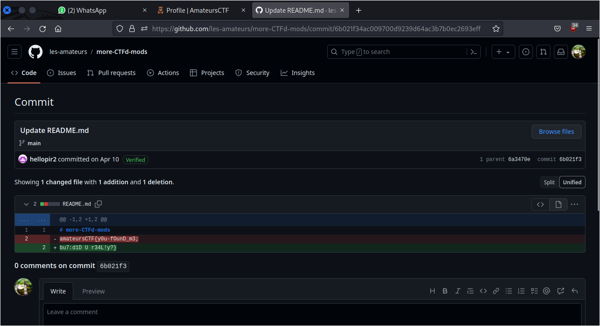

# Gitint 5e

## Deskripsi
One of the repos in the les-amateurs organization is kind of suspicious. Can you find all the real flags in that repository and report back? There are 3 flags total, one of which is worth 0 points. For this challenge, submit the flag with the sha256 hash 
```
5e60b82a7b0860b53b6f100f599a5e04d52faf1a556ea78578e594af2e2ccf7c
```

## Solusi
Seperti nama dan deskripsi dari challenge ini, maka dilakukan pencarian Github dari `les-amateurs` pada Google. Hasilnya ditemukan akun Github [berikut](https://github.com/les-amateurs).
Pencarian kemudian dilanjutkan dengan melihat waktu commit pada repostori yang mendekati waktu saat CTF ini diselenggarakan.
Ditemukan sebuah repositori [berikut](https://github.com/les-amateurs/more-CTFd-mods/branches) yang memiliki 2 branch dan salah satunya branch nya bernama flag.
Pencarian selanjutnya dilakukan pada branch flag. Disini ditemukan flag pada commit dengan pesan Inital Commit dan Update README.md



Sekarang kita cek terlebih dahulu flag tersebut, apakah sama dengan sha256 yang diberikan pada deskripsi soal.

```
$ echo -n 'amateursCTF{y0u-fOunD_m3;bu7:d1D U r34L!y?}' | sha256sum
5e60b82a7b0860b53b6f100f599a5e04d52faf1a556ea78578e594af2e2ccf7c  -
```

## Flag
### amateursCTF{y0u-fOunD_m3;bu7:d1D U r34L!y?}