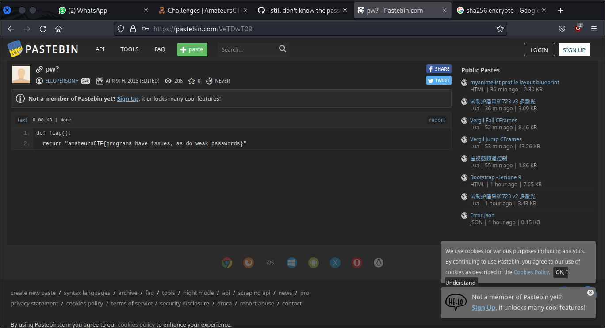

# Gitint 7d

## Deskripsi
One of the repos in the les-amateurs organization is kind of suspicious. Can you find all the real flags in that repository and report back? There are 3 flags total, one of which is worth 0 points. For this challenge, submit the flag with the sha256 hash 
```
7de880d63a3f2494b75286906dba179ee59cc738ea5e275094f94c5457396f48
```
NOTE:
You may get iplocked out of the pastebin if you guess the password too many times, so please don't guess. The password is obvious when you see it.

## Solusi
Setelah kita menemukan flag pada challenge sebelumnya, yaitu `Gitint 5e` sekarang pencarian kembali dilakukan pada repositori tersebut, karena di dalam deskripsi soal disebutkan salah satu repositori yang memiliki flag di dalamnya.
Kali ini pencarian dilakukan dengan memanfaatkan fitur search yang ada pada Github. Pencarian menggunakan keyword berikut.

```
repo:les-amateurs/more-CTFd-mods flag
```

Dari pencarian tersebut terdapat hasil yang cukup menarik, yaitu pada Issues terdapat satu entry.
Pada challenge sebelumnya belum dilakukan pengecekan pada bagian Issues, jadi langsung saja dicek.
Dari issues tersebut kita mendapatkan link [pastebin](https://pastebin.com/VeTDwT09)


Tetapi pastebin tersebut membutuhkan password untuk membukanya. Mari kita check kembali pada repository `more-CTFd-mods` untuk mencari password yang kemungkinan ada pada repository tersebut.
Pencarian kembali dilakukan dengan menggunakan fitur search yang ada pada Github, berikut adalah keyword yang digunakan.

```
repo:les-amateurs/more-CTFd-mods password
```

Pada hasil pencarian, muncul Pull requests yang cocok dengan keyword yang diberikan. 
Password nya terdapat pada original comment yang sebelumnya telah diedit pada Pull requests.


Setelah membuka pastebin dengan password tersebut, didapatkan flag yang dicari.



Dilakukan pengecekan sha256 hash untuk memastikan bahwa flag tersebut benar.

```
$ echo -n 'amateursCTF{programs have issues, as do weak passwords}' | sha256sum
7de880d63a3f2494b75286906dba179ee59cc738ea5e275094f94c5457396f48  -
```

## Flag
### amateursCTF{programs have issues, as do weak passwords}