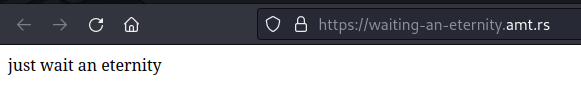
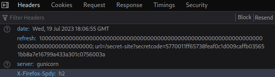
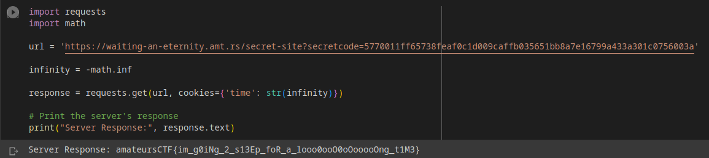

# waiting-an-eternity

## Deskripsi
My friend sent me this website and said that if I wait long enough, I could get and flag! Not that I need a flag or anything, but I've been waiting a couple days and it's still asking me to wait. I'm getting a little impatient, could you help me get the flag?

https://waiting-an-eternity.amt.rs

## Solusi
Diberikan sebuah challenge seperti berikut ini.



Kemudian jika kita check pada response yang diberikan oleh server menunjukkan secret URL yang kemungkinan berisi flag.



Dilakukan pengecekan lagi terhadap secret URL tersebut. Dari hasil pengecekan ditemukan cookie `time` yang nilai awalnya berupa waktu dari server. 


Nilai waktu pada cookie `time` menunjukkan waktu dalam [Unix timestamp](https://www.unixtimestamp.com/) atau juga biasa disebut dengan epoch. 
Jika nilai waktu `time` diganti lebih besar dari waktu server saat ini, maka hasilnya akan menjadi negatif Unix timestamp, sedangkan jika jika nilai waktu `time` diganti dengan nilai yang negatif maka hasilnya adalah nilai waktu yang lebih besar dari waktu server saat ini. Sehingga dapat dibuat persamaan sederhana seperti berikut ini.

```
time = current server time - input time from user
```

Jika kita lihat lagi pada judul dari challenge ini yang mengisyaratkan untuk mengganti waktu menjadi selamanya atau bisa dibilang sebagai bilangan infinity. Maka dapat dibuat sebuah script Python sederhana berikut ini yang akan mengirimkan waktu berupa negatif infinity pada cookie `time`.

```python
import requests
import math

url = 'https://waiting-an-eternity.amt.rs/secret-site?secretcode=5770011ff65738feaf0c1d009caffb035651bb8a7e16799a433a301c0756003a'

infinity = -math.inf

res = requests.get(url, cookies={'time': str(infinity)})

print("Server response:", res.text)
```

Berikut ini adalah response yang dikirimkan oleh server ketika mengirimkan negatif infinity pada cookie `time`.



## Flag
### amateursCTF{im_g0iNg_2_s13Ep_foR_a_looo0ooO0oOooooOng_t1M3}
