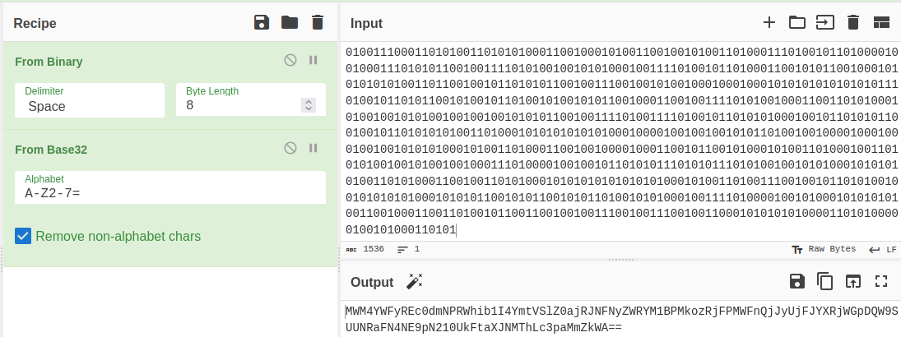
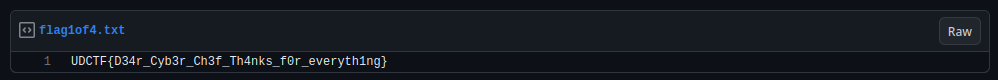

# Greatest Hits 1 of 4

## Description
Start of a 4 part journey covering favorite basics:

https://gist.github.com/AndyNovo/5ef52bd5de7a210ff3390fe424297704

-ProfNinja

## Solution
When we open the given URL, we got a file written using binary like this.

We can use [CyberChef](https://gchq.github.io/CyberChef/) to decode the message that have been written using binary. 

After we decode the message, we got a base32 message. 
Then we just need to add the recipe in CyberChef to decode the base32 message.

After that we got a base64 message.
Again just add recipe in CyberChef to decode base64.

The result from decoding base64 message looks like a base64, but this is not a base64 encoded message.
Actually this is a [base62](https://en.wikipedia.org/wiki/Base62) encoded message, the difference between base62 and base64 is in base64 there's no `+/` characters.

After decoding base62, we got a link to get to flag for this challenge and the problem for part 2 of this challenge.

## Flag
`UDCTF{D34r_Cyb3r_Ch3f_Th4nks_f0r_everyth1ng}`

