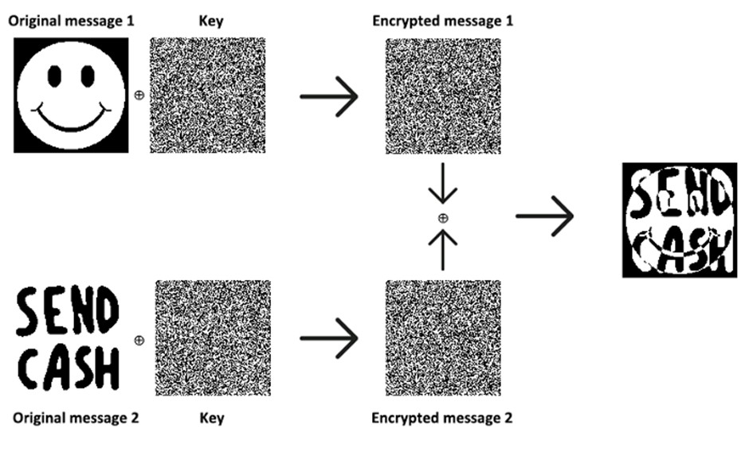

# easy AES

## Deskripsi
Attack on AES OFB

Author: prajnapras19

`nc ctf-gemastik.ub.ac.id 10002`

## Attachment
[chall.py](./Challenge/chall.py)

## Solusi
Program yang diberikan merupakan implementasi dari enkripsi AES dengan mode OFB. 
Key dan initialization vector (IV) di-generate secara random. 
Untuk mengakses flag.txt, nilai dari secret perlu didapatkan dari encrypted secret yang merupakan ciphertext yang diketahui.

Berdasarkan [Wikipedia](https://en.wikipedia.org/wiki/Block_cipher_mode_of_operation) algoritma AES OFB enkripsi dan dekripsi tidak bergantung pada plainteks.


Dan karena key dan IV bersifat static, hanya operasi XOR yang tersisa dari enkripsi-dekripsi. Sehingga chosen plaintext dapat dilakukan dengan sifat XOR:


Sumber gambar: link [berikut](https://thusithathilina.medium.com/reused-key-vulnerability-in-one-time-pad-for-ctf-9e1fc04015c)

Hal ini sama seperti penggunaan key kembali pada one-time pad. Karena x ⊕ x = 0 dan 
x ⊕ 0 = x, maka c1 ⊕ c2 = m1 ⊕ m2, dan m1 ⊕ m2 ⊕ m2 = m1 ⊕ 0 = m1. Dibuat program python dengan encrypted secret = c1, secret = m1, custom plaintext = m2, dan custom ciphertext = c2.

```py
from Crypto.Util.number import bytes_to_long, long_to_bytes


def xor_long_ints(a, b):
    # Convert the long integers to bytes
    bytes_a = long_to_bytes(a)
    bytes_b = long_to_bytes(b)
    # Perform the XOR operation on the bytes
    result_bytes = bytes(x ^ y for x, y in zip(bytes_a, bytes_b))
    # Convert the result back to a long integer
    return bytes_to_long(result_bytes)


m2 = 145647720128140965794769820842132871951851086081384220431990791055741482342175132696478632029377666385481290783298256528925848709275904237320042692850239328398793713594941914370669694449904452622480873070252683013472244572349909638979536663423473094092540586257467074230416515771590258256084480146292362538591
c2 = 58574778144425955100825690662268860890193665069358602887406099191419986140593259043280783520564144195161470870995632698917144977933917452551138209330624764907401480226295779801287728962725827753655442065722252479931453352549098471705332640225670585111956795701430798892201073160024558751001093188841440790252814851575399105539923995062443039972501
c1 = 26333899557118392560410222715667810627369297834406244872716055221364113541082895925054949029070316279599736310869358388891938589242224044988637934997264292208235080598407004028715124461216840538725652116137830087325070879666859133686009785344946339834610804321694813593826508885381781024476993014506631095183179728863863153959605582295933903101077


result = xor_long_ints(c1, c2)
m1 = xor_long_ints(result, m2)
print(m1)
```

## Flag
### gemastik{25b79377180f898dab82f1ac1d32ef57fa6ed76406f8ecbc01caf97ee8ad29aa}
