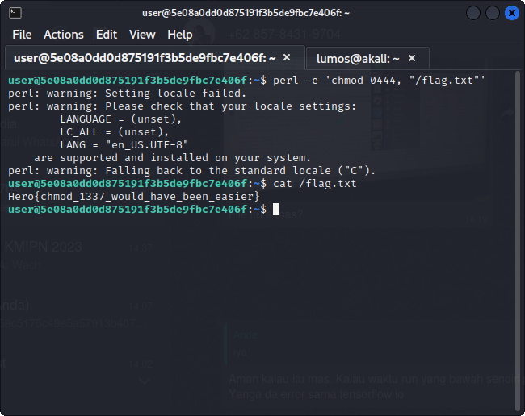

# Chm0d

## Deskripsi
Catch-22: a problematic situation for which the only solution is denied by a circumstance inherent in the problem.
 
Credentials: `user:password123`
 
Deploy on `deploy.heroctf.fr`

Format : Hero{flag}

## Solusi
Saat terhubung ke sistem langsung dicari flag yang ada pada sistem tersebut. 
Ditemukan file `/flag.txt` yang merupakan flag dari challenge ini, namun file tersebut tidak bisa dibaca karena tidak ada satupun permissions pada file tersebut.

Saat menggunakan chmod untuk menambahkan permissions pada file tersebut, menunjukkan bahwa command chmod tidak ditemukan, yang menunjukkan tidak ada command chmod.
Dari link [berikut](https://unix.stackexchange.com/questions/83862/how-to-chmod-without-usr-bin-chmod) kita bisa menggunakan `perl` untuk menjalankan command chmod.

## Flag
### Hero{chmod_1337_would_have_been_easier}
