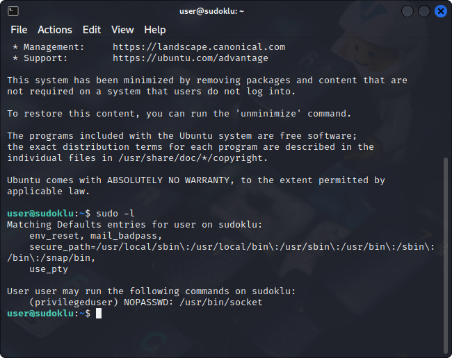

# SUDOkLu

## Deskripsi
This is a warmup to get you going. Your task is to read `/home/privilegeduser/flag.txt`.
 
For our new commers, the title might steer you in the right direction ;). Good luck!
 
Credentials: `user:password123`

Deploy on `deploy.heroctf.fr`

Format : Hero{flag}

## Solusi
Judul dari challenge ini cukup jelas, yaitu kemungkinan challenge akan melibatkan kita untuk menggunakan perintah `sudo`.
Disini dicek terlebih dahulu command apa saja yang bisa dijalankan oleh `user`.

Dari gambar tersebut terlihat bahwa `user` dapat menjalankan program `socket` dengan tanpa memasukkan password sebagai `privilegeduser`.
Program socket ketika dijalankan menu help nya tidak begitu membantu

Karena dari help tersebut kurang begitu jelas, maka harus mencari manualnya.
Manual tersebut ada pada link [berikut](https://manpages.debian.org/bullseye/socket/socket.1.en.html).

Untuk mendapatkan flag digunakan langkah seperti pada gambar di bawah ini.

## Flag
### Hero{che3ck_f0r_m1sc0nf1gur4t1on5}
