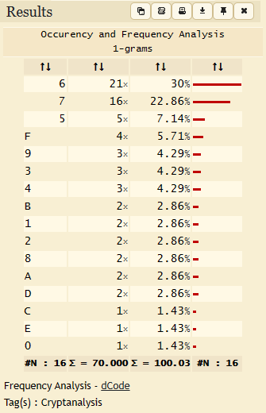
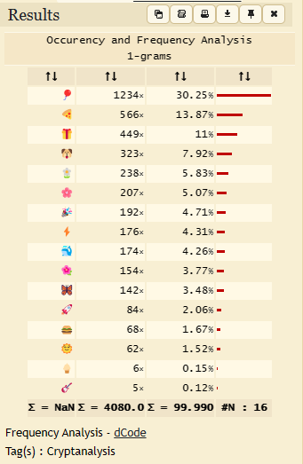

# Emoticons

Platform: ImaginaryCTF 2023

## Description

> It seems that emoji "crypto" challenges are all the rage nowadays... Well, here's another one for you!

## Attachment
[gen.py](./Challenge/) [out.txt](./Challenge/out.txt)

Two files were attached:

`gen.py`:

```python
import random

emojis = [n for n in "🌸🍔🐳🚀🌞🎉🍦🎈🐶🍕🌺🎸⚡️🦋🌼🎁"]
m = open("text.txt", "rb").read().hex()

random.shuffle(emojis)

for e, c in zip(emojis, "0123456789abcdef"):
  m = m.replace(c, e)

open("out.txt", "w").write(m)
```

`out.txt`:

```text
🎉🌼🎈🍔🎈🌺🍕🎉🎈🐳🎈🌸🎈🌺🎈⚡🍕🌸🎁🚀🎁🐶🎈🦋🎈🚀🍕🌸🎈🌺🎁🐶🎈🎸🎈⚡🎈🌺🍕🍕🎈⚡🎁🐶🎈🦋🍕🌸🎁🐶🍕🌸🎈🍔🎈🐳🎈🚀🎈🌼🍕🐳🍕🌸🎁🚀🎁🐶🎈🦋🍕🎁🎈🌼🎁🐶🎈🍕🍕🎁🎈🦋🍕🐶🎈🌞🎈🐳🎈🌸🎈🦋🎈🚀🎁🐶🍕🎁🎈🌼🍕🐶🍕🎁🎈🌼🍕🌸🎈🌼🎈⚡🍕🎉🎈🦋🍕🎉🎈🐳🎈🌺🎈⚡🍕🌸🎁🐶🎈🌺🎈🎈🎁🐶🎈🎈🎈🦋🎈🌸🎈🐳🎈🦋🎈🚀🎁🐶🎈🌼🍕🌞🍕🐶🍕🎁🎈🌼🍕🌸🍕🌸🎈🐳🎈🌺🎈⚡🍕🌸🎁🐶🍕🌼🍕🌸🎈🌼🎈🎉🎁🐶🍕🎉🎈🌺🎁🐶🎈🌸🎈🌺🎈⚡🍕🎈🎈🌼🍕🐳🎁🐶🎈🌼🎈🍔🎈🌺🍕🎉🎈🐳🎈🌺🎈⚡🍕🌸🎁🐶🎈🌺🍕🎁🎁🐶🍕🎉🎈🌺🎈⚡🎈🌼🎁🐶🎈🐳🎈⚡🎁🐶🍕🍕🍕🎁🎈🐳🍕🎉🍕🎉🎈🌼🎈⚡🎁🐶🎈🌸🎈🌺🎈🍔🎈🍔🍕🌼🎈⚡🎈🐳🎈🌸🎈🦋🍕🎉🎈🐳🎈🌺🎈⚡🎁⚡🎁🐶🌼🎉🎈🌞🎈🌼🍕🐳🎁🐶🎈🌞🎈🦋🍕🎈🎈🌼🎁🐶🎈🎁🎈🌼🎈🌸🎈🌺🎈🍔🎈🌼🎁🐶🎈🦋🎈⚡🎁🐶🎈🐳🎈⚡🍕🎉🎈🌼🎈🍕🍕🎁🎈🦋🎈🚀🎁🐶🍕🐶🎈🦋🍕🎁🍕🎉🎁🐶🎈🌺🎈🎈🎁🐶🎈🌺🎈⚡🎈🚀🎈🐳🎈⚡🎈🌼🎁🐶🎈🍔🎈🌼🍕🌸🍕🌸🎈🦋🎈🍕🎈🐳🎈⚡🎈🍕🎁🚀🎁🐶🍕🌸🎈🌺🎈🌸🎈🐳🎈🦋🎈🚀🎁🐶🎈🍔🎈🌼🎈🎉🎈🐳🎈🦋🎁🐶🍕🐶🎈🚀🎈🦋🍕🎉🎈🎈🎈🌺🍕🎁🎈🍔🍕🌸🎁🚀🎁🐶🎈🦋🎈⚡🎈🎉🎁🐶🎈🌼🎈🍔🎈🦋🎈🐳🎈🚀🎁🐶🎈🌸🎈🌺🍕🎁🍕🎁🎈🌼🍕🌸🍕🐶🎈🌺🎈⚡🎈🎉🎈🌼🎈⚡🎈🌸🎈🌼🎁⚡🎁🐶🎉🌼🎈🍔🎈🌺🍕🎉🎈🐳🎈🌸🎈🌺🎈⚡🍕🌸🎁🐶🎈🦋🍕🎁🎈🌼🎁🐶🎈🎈🎈🌺🍕🎁🎈🍔🎈🌼🎈🎉🎁🐶🍕🌼🍕🌸🎈🐳🎈⚡🎈🍕🎁🐶🎈🦋🎁🐶🎈🌸🎈🌺🎈🍔🎈🎁🎈🐳🎈⚡🎈🦋🍕🎉🎈🐳🎈🌺🎈⚡🎁🐶🎈🌺🎈🎈🎁🐶🎈🎸🎈🌼🍕🐳🎈🎁🎈🌺🎈🦋🍕🎁🎈🎉🎁🐶🎈🌸🎈🌞🎈🦋🍕🎁🎈🦋🎈🌸🍕🎉🎈🌼🍕🎁🍕🌸🎁🐶🎈🦋🎈⚡🎈🎉🎁🐶🍕🌸🍕🐳🎈🍔🎈🎁🎈🌺🎈🚀🍕🌸🎁🚀🎁🐶🎈🦋🎈🚀🎈🚀🎈🌺🍕🍕🎈🐳🎈⚡🎈🍕🎁🐶🍕🌼🍕🌸🎈🌼🍕🎁🍕🌸🎁🐶🍕🎉🎈🌺🎁🐶🎈🌼🍕🌞🍕🐶🍕🎁🎈🌼🍕🌸🍕🌸🎁🐶🍕🎉🎈🌞🎈🌼🎈🐳🍕🎁🎁🐶🎈🎈🎈🌼🎈🌼🎈🚀🎈🐳🎈⚡🎈🍕🍕🌸🎁🐶🎈🦋🎈⚡🎈🎉🎁🐶🎈🦋🎈🎉🎈🎉🎁🐶🎈⚡🍕🌼🎈🦋🎈⚡🎈🌸🎈🌼🎁🐶🍕🎉🎈🌺🎁🐶🍕🎉🎈🌞🎈🌼🎈🐳🍕🎁🎁🐶🍕🎉🎈🌼🍕🌞🍕🎉🎁🍔🎈🎁🎈🦋🍕🌸🎈🌼🎈🎉🎁🐶🎈🌸🎈🌺🎈⚡🍕🎈🎈🌼🍕🎁🍕🌸🎈🦋🍕🎉🎈🐳🎈🌺🎈⚡🍕🌸🎁⚡🎁🐶🎈🐳🎈🌸🍕🎉🎈🎈🍕🎸🎈🎈🍕🎁🎈🌼🍕🦋🍕🌼🎈🌼🎈⚡🎈🌸🍕🐳🌼🌺🎈🦋🎈⚡🎈🦋🎈🚀🍕🐳🍕🌸🎈🐳🍕🌸🌼🌺🎈🐳🍕🌸🌼🌺🍕🎁🎈🌼🎈🦋🎈🚀🎈🚀🍕🐳🌼🌺🎈🎈🍕🌼🎈⚡🌼🌺🍕🎁🎈🐳🎈🍕🎈🌞🍕🎉🍕🍔🎁🐶🌼🎉🎈🌞🎈🌼🎁🐶🍕🐶🍕🎁🎈🐳🎈🍔🎈🦋🍕🎁🍕🐳🎁🐶🍕🐶🍕🌼🍕🎁🍕🐶🎈🌺🍕🌸🎈🌼🎁🐶🎈🌺🎈🎈🎁🐶🎈🌼🎈🍔🎈🌺🍕🎉🎈🐳🎈🌸🎈🌺🎈⚡🍕🌸🎁🐶🎈🐳🍕🌸🎁🐶🍕🎉🎈🌺🎁🐶🎈🌼🎈⚡🎈🌞🎈🦋🎈⚡🎈🌸🎈🌼🎁🐶🎈🎉🎈🐳🎈🍕🎈🐳🍕🎉🎈🦋🎈🚀🎁🐶🎈🌸🎈🌺🎈🍔🎈🍔🍕🌼🎈⚡🎈🐳🎈🌸🎈🦋🍕🎉🎈🐳🎈🌺🎈⚡🎁🐶🎈🎁🍕🐳🎁🐶🎈🎁🍕🎁🎈🐳🎈🎉🎈🍕🎈🐳🎈⚡🎈🍕🎁🐶🍕🎉🎈🌞🎈🌼🎁🐶🎈🍕🎈🦋🍕🐶🎁🐶🎈🎁🎈🌼🍕🎉🍕🍕🎈🌼🎈🌼🎈⚡🎁🐶🍕🍕🍕🎁🎈🐳🍕🎉🍕🎉🎈🌼🎈⚡🎁🐶🍕🎉🎈🌼🍕🌞🍕🎉🎁🐶🎈🦋🎈⚡🎈🎉🎁🐶🎈🎈🎈🦋🎈🌸🎈🌼🎁🍔🍕🎉🎈🌺🎁🍔🎈🎈🎈🦋🎈🌸🎈🌼🎁🐶🎈🐳🎈⚡🍕🎉🎈🌼🍕🎁🎈🦋🎈🌸🍕🎉🎈🐳🎈🌺🎈⚡🍕🌸🎁⚡🎁🐶🌼🎉🎈🌞🎈🌼🍕🐳🎁🐶🍕🐶🍕🎁🎈🌺🍕🎈🎈🐳🎈🎉🎈🌼🎁🐶🎈🦋🎁🐶🍕🍕🎈🦋🍕🐳🎁🐶🍕🎉🎈🌺🎁🐶🎈🌸🎈🌺🎈⚡🍕🎈🎈🌼🍕🐳🎁🐶🎈🌼🎈🍔🎈🌺🍕🎉🎈🐳🎈🌺🎈⚡🍕🌸🎁🚀🎁🐶🍕🌸🍕🌼🎈🌸🎈🌞🎁🐶🎈🦋🍕🌸🎁🐶🎈🌞🎈🦋🍕🐶🍕🐶🎈🐳🎈⚡🎈🌼🍕🌸🍕🌸🎁🚀🎁🐶🍕🌸🎈🦋🎈🎉🎈⚡🎈🌼🍕🌸🍕🌸🎁🚀🎁🐶🍕🌸🍕🌼🍕🎁🍕🐶🍕🎁🎈🐳🍕🌸🎈🌼🎁🚀🎁🐶🎈🌺🍕🎁🎁🐶🎈🌞🍕🌼🎈🍔🎈🌺🍕🎁🎁🚀🎁🐶🍕🍕🎈🌞🎈🐳🎈🌸🎈🌞🎁🐶🎈🌸🎈🦋🎈⚡🎁🐶🎈🎁🎈🌼🎁🐶🎈🌸🎈🌞🎈🦋🎈🚀🎈🚀🎈🌼🎈⚡🎈🍕🎈🐳🎈⚡🎈🍕🎁🐶🍕🎉🎈🌺🎁🐶🎈🌼🍕🌞🍕🐶🍕🎁🎈🌼🍕🌸🍕🌸🎁🐶🍕🌸🎈🌺🎈🚀🎈🌼🎈🚀🍕🐳🎁🐶🍕🎉🎈🌞🍕🎁🎈🌺🍕🌼🎈🍕🎈🌞🎁🐶🍕🍕🎈🌺🍕🎁🎈🎉🍕🌸🎁⚡🎁🐶🎉🎈🎈🌺🍕🎁🎁🐶🎈🌼🍕🌞🎈🦋🎈🍔🍕🐶🎈🚀🎈🌼🎁🚀🎁🐶🎈🦋🎁🐶🍕🌸🎈🐳🎈🍔🍕🐶🎈🚀🎈🌼🎁🐶🍕🌸🎈🍔🎈🐳🎈🚀🎈🌼🍕🐳🎁🐶🎈🎈🎈🦋🎈🌸🎈🌼🎁🐶🌸🍦🎁🐳🎁🐶🎈🌸🎈🦋🎈⚡🎁🐶🎈🎉🎈🌼🎈⚡🎈🌺🍕🎉🎈🌼🎁🐶🎈🌞🎈🦋🍕🐶🍕🐶🎈🐳🎈⚡🎈🌼🍕🌸🍕🌸🎁🐶🎈🌺🍕🎁🎁🐶🎈🎈🍕🎁🎈🐳🎈🌼🎈⚡🎈🎉🎈🚀🎈🐳🎈⚡🎈🌼🍕🌸🍕🌸🎁🚀🎁🐶🍕🍕🎈🌞🎈🐳🎈🚀🎈🌼🎁🐶🎈🦋🎁🐶🎈🎈🍕🎁🎈🌺🍕🍕🎈⚡🎈🐳🎈⚡🎈🍕🎁🐶🎈🎈🎈🦋🎈🌸🎈🌼🎁🐶🌸🍦🎁🌞🎁🐶🎈🌸🎈🦋🎈⚡🎁🐶🎈🐳🎈⚡🎈🎉🎈🐳🎈🌸🎈🦋🍕🎉🎈🌼🎁🐶🍕🌸🎈🦋🎈🎉🎈⚡🎈🌼🍕🌸🍕🌸🎁🐶🎈🌺🍕🎁🎁🐶🎈🎉🎈🐳🍕🌸🎈🦋🍕🐶🍕🐶🎈🌺🎈🐳🎈⚡🍕🎉🎈🍔🎈🌼🎈⚡🍕🎉🎁⚡🎁🐶🎉🌼🎈🍔🎈🌺🍕🎉🎈🐳🎈🌸🎈🌺🎈⚡🍕🌸🎁🐶🎈🌺🎈🎈🎈🎈🎈🌼🍕🎁🎁🐶🎈🦋🎁🐶🍕🎈🎈🐳🍕🌸🍕🌼🎈🦋🎈🚀🎁🐶🍕🌸🎈🌞🎈🌺🍕🎁🍕🎉🎈🌞🎈🦋🎈⚡🎈🎉🎁🐶🍕🎉🎈🌞🎈🦋🍕🎉🎁🐶🎈🌞🎈🌼🎈🚀🍕🐶🍕🌸🎁🐶🎈🌸🎈🚀🎈🦋🍕🎁🎈🐳🎈🎈🍕🐳🎁🐶🍕🎉🎈🌞🎈🌼🎁🐶🎈🐳🎈⚡🍕🎉🎈🌼🎈⚡🎈🎉🎈🌼🎈🎉🎁🐶🎈🌼🎈🍔🎈🌺🍕🎉🎈🐳🎈🌺🎈⚡🎈🦋🎈🚀🎁🐶🎈🌸🎈🌺🎈⚡🍕🎉🎈🌼🍕🌞🍕🎉🎁🐶🎈🌺🎈🎈🎁🐶🎈🦋🎁🐶🎈🍔🎈🌼🍕🌸🍕🌸🎈🦋🎈🍕🎈🌼🎁🚀🎁🐶🍕🎁🎈🌼🎈🎉🍕🌼🎈🌸🎈🐳🎈⚡🎈🍕🎁🐶🍕🎉🎈🌞🎈🌼🎁🐶🎈🌸🎈🌞🎈🦋🎈⚡🎈🌸🎈🌼🍕🌸🎁🐶🎈🌺🎈🎈🎁🐶🎈🍔🎈🐳🍕🌸🎈🌸🎈🌺🎈🍔🎈🍔🍕🌼🎈⚡🎈🐳🎈🌸🎈🦋🍕🎉🎈🐳🎈🌺🎈⚡🎁🐶🎈🌺🍕🎁🎁🐶🎈🍔🎈🐳🍕🌸🍕🌼🎈⚡🎈🎉🎈🌼🍕🎁🍕🌸🍕🎉🎈🦋🎈⚡🎈🎉🎈🐳🎈⚡🎈🍕🍕🌸🎁⚡🎁🐶🎉🍔🎈🌺🍕🎁🎈🌼🎈🌺🍕🎈🎈🌼🍕🎁🎁🚀🎁🐶🎈🌼🎈🍔🎈🌺🍕🎉🎈🐳🎈🌸🎈🌺🎈⚡🍕🌸🎁🐶🎈🦋🎈🚀🍕🌸🎈🌺🎁🐶🎈🌸🎈🌺🎈⚡🍕🎉🍕🎁🎈🐳🎈🎁🍕🌼🍕🎉🎈🌼🎁🐶🍕🎉🎈🌺🎁🐶🍕🎉🎈🌞🎈🌼🎁🐶🎈🌸🍕🎁🎈🌼🎈🦋🍕🎉🎈🐳🎈🌺🎈⚡🎁🐶🎈🌺🎈🎈🎁🐶🎈🦋🎁🐶🎈🍔🎈🌺🍕🎁🎈🌼🎁🐶🍕🐶🎈🌼🍕🎁🍕🌸🎈🌺🎈⚡🎈🦋🎈🚀🎈🐳🍕🍦🎈🌼🎈🎉🎁🐶🎈🦋🎈⚡🎈🎉🎁🐶🍕🎁🎈🌼🎈🚀🎈🦋🍕🎉🎈🦋🎈🎁🎈🚀🎈🌼🎁🐶🎈🌺🎈⚡🎈🚀🎈🐳🎈⚡🎈🌼🎁🐶🎈🌼🎈⚡🍕🎈🎈🐳🍕🎁🎈🌺🎈⚡🎈🍔🎈🌼🎈⚡🍕🎉🎁⚡🎁🐶🎉🎁🍕🐳🎁🐶🍕🌼🍕🌸🎈🐳🎈⚡🎈🍕🎁🐶🎈🌼🎈🍔🎈🌺🍕🎉🎈🐳🎈🌸🎈🌺🎈⚡🍕🌸🎁🚀🎁🐶🎈🐳🎈⚡🎈🎉🎈🐳🍕🎈🎈🐳🎈🎉🍕🌼🎈🦋🎈🚀🍕🌸🎁🐶🎈🌸🎈🦋🎈⚡🎁🐶🎈🐳🎈⚡🎈🎈🍕🌼🍕🌸🎈🌼🎁🐶🍕🎉🎈🌞🎈🌼🎈🐳🍕🎁🎁🐶🍕🍕🍕🎁🎈🐳🍕🎉🍕🎉🎈🌼🎈⚡🎁🐶🎈🍔🎈🌼🍕🌸🍕🌸🎈🦋🎈🍕🎈🌼🍕🌸🎁🐶🍕🍕🎈🐳🍕🎉🎈🌞🎁🐶🍕🐶🎈🌼🍕🎁🍕🌸🎈🌺🎈⚡🎈🦋🎈🚀🎈🐳🍕🎉🍕🐳🎁🚀🎁🐶🎈🌞🍕🌼🎈🍔🎈🌺🍕🎁🎁🚀🎁🐶🎈🌺🍕🎁🎁🐶🍕🌸🎈🦋🍕🎁🎈🌸🎈🦋🍕🌸🎈🍔🎁⚡🎁🐶🌼🎉🎈🌞🎈🐳🍕🌸🎁🐶🎈🦋🎈🎉🎈🎉🍕🌸🎁🐶🎈🎉🎈🌼🍕🐶🍕🎉🎈🌞🎁🐶🎈🦋🎈⚡🎈🎉🎁🐶🍕🎁🎈🐳🎈🌸🎈🌞🎈⚡🎈🌼🍕🌸🍕🌸🎁🐶🍕🎉🎈🌺🎁🐶🎈🌸🎈🌺🎈⚡🍕🎈🎈🌼🍕🎁🍕🌸🎈🦋🍕🎉🎈🐳🎈🌺🎈⚡🍕🌸🎁🚀🎁🐶🎈🍔🎈🦋🎈🎸🎈🐳🎈⚡🎈🍕🎁🐶🍕🎉🎈🌞🎈🌼🎈🍔🎁🐶🎈🍔🎈🌺🍕🎁🎈🌼🎁🐶🎈🌼🎈⚡🎈🍕🎈🦋🎈🍕🎈🐳🎈⚡🎈🍕🎁🐶🎈🦋🎈⚡🎈🎉🎁🐶🎈🌼🎈⚡🎈🍦🎈🌺🍕🐳🎈🦋🎈🎁🎈🚀🎈🌼🎁⚡🎁🐶🎉🌼🎈🍔🎈🌺🍕🎉🎈🐳🎈🌸🎈🌺🎈⚡🍕🌸🎁🐶🍕🌸🎈🌼🍕🎁🍕🎈🎈🌼🎁🐶🎈🦋🍕🌸🎁🐶🎈🦋🎁🐶🎈🎈🎈🌺🍕🎁🎈🍔🎁🐶🎈🌺🎈🎈🎁🐶🎈⚡🎈🌺🎈⚡🍕🎈🎈🌼🍕🎁🎈🎁🎈🦋🎈🚀🎁🐶🎈🌸🎈🌺🎈🍔🎈🍔🍕🌼🎈⚡🎈🐳🎈🌸🎈🦋🍕🎉🎈🐳🎈🌺🎈⚡🎁🐶🎈🐳🎈⚡🎁🐶🍕🎉🎈🌞🎈🌼🎁🐶🎈🎉🎈🐳🎈🍕🎈🐳🍕🎉🎈🦋🎈🚀🎁🐶🍕🎁🎈🌼🎈🦋🎈🚀🎈🍔🎁🚀🎁🐶🍕🐶🍕🎁🎈🌺🍕🎈🎈🐳🎈🎉🎈🐳🎈⚡🎈🍕🎁🐶🎈🦋🎁🐶🍕🍕🎈🦋🍕🐳🎁🐶🍕🎉🎈🌺🎁🐶🎈🌸🎈🌺🎈⚡🍕🎈🎈🌼🍕🐳🎁🐶🍕🌸🍕🌼🎈🎁🍕🎉🎈🚀🎈🌼🎁🐶🎈🌸🍕🌼🎈🌼🍕🌸🎁🐶🎈🦋🎈⚡🎈🎉🎁🐶🎈🌼🎈🍔🎈🌺🍕🎉🎈🐳🎈🌺🎈⚡🎈🦋🎈🚀🎁🐶🎈⚡🍕🌼🎈🦋🎈⚡🎈🌸🎈🌼🍕🌸🎁🐶🍕🎉🎈🌞🎈🦋🍕🎉🎁🐶🍕🍕🎈🌺🍕🌼🎈🚀🎈🎉🎁🐶🍕🎉🍕🐳🍕🐶🎈🐳🎈🌸🎈🦋🎈🚀🎈🚀🍕🐳🎁🐶🎈🎁🎈🌼🎁🐶🎈🌼🍕🌞🍕🐶🍕🎁🎈🌼🍕🌸🍕🌸🎈🌼🎈🎉🎁🐶🍕🎉🎈🌞🍕🎁🎈🌺🍕🌼🎈🍕🎈🌞🎁🐶🎈🎈🎈🦋🎈🌸🎈🐳🎈🦋🎈🚀🎁🐶🎈🌼🍕🌞🍕🐶🍕🎁🎈🌼🍕🌸🍕🌸🎈🐳🎈🌺🎈⚡🍕🌸🎁🚀🎁🐶🎈🍕🎈🌼🍕🌸🍕🎉🍕🌼🍕🎁🎈🌼🍕🌸🎁🚀🎁🐶🎈🌺🍕🎁🎁🐶🍕🎉🎈🌺🎈⚡🎈🌼🎁🐶🎈🌺🎈🎈🎁🐶🍕🎈🎈🌺🎈🐳🎈🌸🎈🌼🎁🐶🎈🐳🎈⚡🎁🐶🎈🎈🎈🦋🎈🌸🎈🌼🎁🍔🍕🎉🎈🌺🎁🍔🎈🎈🎈🦋🎈🌸🎈🌼🎁🐶🎈🐳🎈⚡🍕🎉🎈🌼🍕🎁🎈🦋🎈🌸🍕🎉🎈🐳🎈🌺🎈⚡🍕🌸🎁⚡🎁🐶🎉🐳🎈⚡🎁🐶🍕🌸🍕🌼🎈🍔🎈🍔🎈🦋🍕🎁🍕🐳🎁🚀🎁🐶🎈🌼🎈🍔🎈🌺🍕🎉🎈🐳🎈🌸🎈🌺🎈⚡🍕🌸🎁🐶🎈🦋🍕🎁🎈🌼🎁🐶🎈🍕🍕🎁🎈🦋🍕🐶🎈🌞🎈🐳🎈🌸🎈🦋🎈🚀🎁🐶🍕🎁🎈🌼🍕🐶🍕🎁🎈🌼🍕🌸🎈🌼🎈⚡🍕🎉🎈🦋🍕🎉🎈🐳🎈🌺🎈⚡🍕🌸🎁🐶🎈🌺🎈🎈🎁🐶🎈🎈🎈🦋🎈🌸🎈🐳🎈🦋🎈🚀🎁🐶🎈🌼🍕🌞🍕🐶🍕🎁🎈🌼🍕🌸🍕🌸🎈🐳🎈🌺🎈⚡🍕🌸🎁🐶🍕🎉🎈🌞🎈🦋🍕🎉🎁🐶🎈🌞🎈🦋🍕🎈🎈🌼🎁🐶🍕🎁🎈🌼🍕🎈🎈🌺🎈🚀🍕🌼🍕🎉🎈🐳🎈🌺🎈⚡🎈🐳🍕🍦🎈🌼🎈🎉🎁🐶🎈🌺🎈⚡🎈🚀🎈🐳🎈⚡🎈🌼🎁🐶🎈🌸🎈🌺🎈🍔🎈🍔🍕🌼🎈⚡🎈🐳🎈🌸🎈🦋🍕🎉🎈🐳🎈🌺🎈⚡🎁⚡🎁🐶🌼🎉🎈🌞🎈🌼🍕🐳🎁🐶🎈🦋🎈🚀🎈🚀🎈🌺🍕🍕🎁🐶🎈🐳🎈⚡🎈🎉🎈🐳🍕🎈🎈🐳🎈🎉🍕🌼🎈🦋🎈🚀🍕🌸🎁🐶🍕🎉🎈🌺🎁🐶🎈🌼🍕🌞🍕🐶🍕🎁🎈🌼🍕🌸🍕🌸🎁🐶🎈🌼🎈🍔🎈🌺🍕🎉🎈🐳🎈🌺🎈⚡🍕🌸🎁🐶🎈🦋🎈⚡🎈🎉🎁🐶🎈🦋🎈🎉🎈🎉🎁🐶🎈🌸🎈🌺🎈⚡🍕🎉🎈🌼🍕🌞🍕🎉🎁🐶🍕🎉🎈🌺🎁🐶🍕🎉🎈🌞🎈🌼🎈🐳🍕🎁🎁🐶🍕🍕🍕🎁🎈🐳🍕🎉🍕🎉🎈🌼🎈⚡🎁🐶🎈🍔🎈🌼🍕🌸🍕🌸🎈🦋🎈🍕🎈🌼🍕🌸🎁🚀🎁🐶🎈🐳🎈🍔🍕🐶🍕🎁🎈🌺🍕🎈🎈🐳🎈⚡🎈🍕🎁🐶🍕🌼🎈⚡🎈🎉🎈🌼🍕🎁🍕🌸🍕🎉🎈🦋🎈⚡🎈🎉🎈🐳🎈⚡🎈🍕🎁🐶🎈🦋🎈⚡🎈🎉🎁🐶🍕🎁🎈🌼🎈🎉🍕🌼🎈🌸🎈🐳🎈⚡🎈🍕🎁🐶🍕🎉🎈🌞🎈🌼🎁🐶🍕🎁🎈🐳🍕🌸🎈🎸🎁🐶🎈🌺🎈🎈🎁🐶🎈🍔🎈🐳🍕🌸🎈🌸🎈🌺🎈🍔🎈🍔🍕🌼🎈⚡🎈🐳🎈🌸🎈🦋🍕🎉🎈🐳🎈🌺🎈⚡🎁⚡🎁🐶🎉🎁🍕🐳🎁🐶🎈🐳🎈⚡🎈🌸🎈🌺🍕🎁🍕🐶🎈🌺🍕🎁🎈🦋🍕🎉🎈🐳🎈⚡🎈🍕🎁🐶🎈🌼🎈🍔🎈🌺🍕🎉🎈🐳🎈🌸🎈🌺🎈⚡🍕🌸🎁🐶🎈🐳🎈⚡🍕🎉🎈🌺🎁🐶🎈🎉🎈🐳🎈🍕🎈🐳🍕🎉🎈🦋🎈🚀🎁🐶🎈🌸🎈🌺🎈⚡🍕🎈🎈🌼🍕🎁🍕🌸🎈🦋🍕🎉🎈🐳🎈🌺🎈⚡🍕🌸🎁🚀🎁🐶🍕🐶🎈🌼🎈🌺🍕🐶🎈🚀🎈🌼🎁🐶🎈🌸🎈🦋🎈⚡🎁🐶🎈🐳🎈⚡🎈🎈🍕🌼🍕🌸🎈🌼🎁🐶🍕🎉🎈🌞🎈🌼🎈🐳🍕🎁🎁🐶🍕🎉🎈🌼🍕🌞🍕🎉🍕🌸🎁🐶🍕🍕🎈🐳🍕🎉🎈🌞🎁🐶🍕🐶🎈🌼🍕🎁🍕🌸🎈🌺🎈⚡🎈🦋🎈🚀🎈🐳🍕🎉🍕🐳🎁🐶🎈🦋🎈⚡🎈🎉🎁🐶🎈🌸🍕🎁🎈🌼🎈🦋🍕🎉🎈🌼🎁🐶🎈🦋🎁🐶🎈🍔🎈🌺🍕🎁🎈🌼🎁🐶🍕🎈🎈🐳🎈🎁🍕🎁🎈🦋🎈⚡🍕🎉🎁🐶🎈🦋🎈⚡🎈🎉🎁🐶🍕🎁🎈🌼🎈🚀🎈🦋🍕🎉🎈🦋🎈🎁🎈🚀🎈🌼🎁🐶🎈🌺🎈⚡🎈🚀🎈🐳🎈⚡🎈🌼🎁🐶🎈🌼🎈⚡🍕🎈🎈🐳🍕🎁🎈🌺🎈⚡🎈🍔🎈🌼🎈⚡🍕🎉🎁⚡🐶🍦
```

## Solution

From what we see here, the gen.py program opens text.txt file that contains the flag, converts it to hexadecimal, and replaces each hexadecimal digit with a randomly shuffled emoji. The encoded text is then saved in `out.txt`. With this information, we can attempt to reverse the process using `frequency analysis`.

We know that the flag has a format similar to `ictf{abc_defghijklmn_opqrs_tuvwxyz}`. When converted to hex, it becomes:
`696374667b6162635f6465666768696a6b6c6d6e5f6f707172735f7475767778797a7d`

We can use a tool like [dcode](https://www.dcode.fr/frequency-analysis) to analyze the characters frequency.

`hex frequency:`



`out.txt emoji frequency:`



Based on the comparison. We can assume that `🎈: 6` and `🍕: 7`. To find the flag location in `out.txt`, we look for the pattern `ictf{` which corresponds to `696374667b` and the pattern `}` which corresponds to `7d`.
In emoji format it should look like this:

`🎈9🎈3🍕4🎈🎈🍕b` ended in `🍕d`

We find the same pattern in:

```text
🎈🐳🎈🌸🍕🎉🎈🎈🍕🎸🎈🎈🍕🎁🎈🌼🍕🦋🍕🌼🎈🌼🎈⚡🎈🌸🍕🐳🌼🌺🎈🦋🎈⚡🎈🦋🎈🚀🍕🐳🍕🌸🎈🐳🍕🌸🌼🌺🎈🐳🍕🌸🌼🌺🍕🎁🎈🌼🎈🦋🎈🚀🎈🚀🍕🐳🌼🌺🎈🎈🍕🌼🎈⚡🌼🌺🍕🎁🎈🐳🎈🍕🎈🌞🍕🎉🍕🍔
```

From this sequence, we get more clues:
`🐳: 9`, `🌸: 3`, `🎉: 4`, `🎸: b` (very likely)
`🍔: d` (assumption)
We also notice that in the suspected emoji above, there are 4 occurrences of the 🌼🌺 pattern, which corresponds to the character `_`, or `5f`.
So, `🌼: 5` and `🌺: f`.

Now, we can manually map the remaining emojis to form the flag.
Script:

```python
import re

def convert_emojis_to_hex(text):
    # Define a dictionary to map emojis to hexadecimal digits
    emoji_to_hex = {
        "🐶": "0",
        "🦋": "1",  ##
        "🎁": "2",  ##
        "🌸": "3",  ###
        "🎉": "4",  ###
        "🌼": "5",  ##
        "🎈": "6",  ###
        "🍕": "7",  ###
        "🌞": "8",  ##
        "🐳": "9",  ###
        "🍦": "a",
        "🎸": "b",  ###
        "🚀": "c",  ##
        "🍔": "d",  ###
        "⚡": "e",  ##
        "🌺": "f",  ##
    }

    # Use regex to extract emojis from the input text
    emoji_pattern = re.compile(r"[^\w\s,]")
    emojis = emoji_pattern.findall(text)

    # Convert emojis back to hexadecimal digits
    hex_string = "".join(emoji_to_hex[emoji] for emoji in emojis)

    return hex_string
                   #  i    c    t    f    {    f    r    e    q    u    e    n    c   y     _    a    n    a    l    y    s    i    s
def main():        # 6 9  6 3  7  4 6 6 7  b  6 6  7 2  6 5  7 1  7 5  6 5  6 e  6 f  7 9  5 f  6 1
    input_emojis = "🎈🐳🎈🌸🍕🎉🎈🎈🍕🎸🎈🎈🍕🎁🎈🌼🍕🦋🍕🌼🎈🌼🎈⚡🎈🌸🍕🐳🌼🌺🎈🦋🎈⚡🎈🦋🎈🚀🍕🐳🍕🌸🎈🐳🍕🌸🌼🌺🎈🐳🍕🌸🌼🌺🍕🎁🎈🌼🎈🦋🎈🚀🎈🚀🍕🐳🌼🌺🎈🎈🍕🌼🎈⚡🌼🌺🍕🎁🎈🐳🎈🍕🎈🌞🍕🎉🍕🍔"
    hex_string = convert_emojis_to_hex(input_emojis)

    print("Recovered hexadecimal string:")
    print(hex_string)

    # Convert hexadecimal to bytes
    bytes_data = bytes.fromhex(hex_string)

    # Decode bytes to a string using utf-8 encoding
    decoded_string = bytes_data.decode('utf-8')

    print(decoded_string)


if __name__ == "__main__":
    main()
```

## Flag 
### ictf{frequency_analysis_is_really_fun_right}
