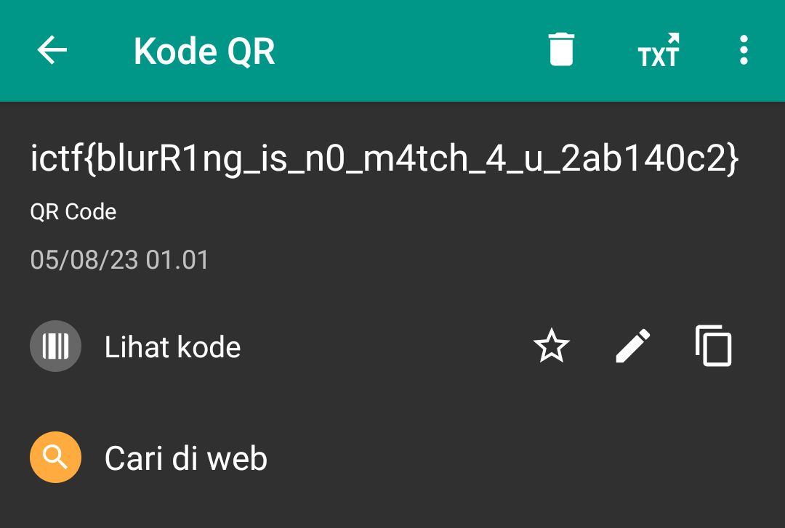

# blurry

## Deskripsi
QR codes are error-correcting... whatever that means. How much error can it take though?

## Attachment
[chall.png](./Challenge/chall.png)

## Solusi
Diberikan sebuah gambar QR code yang sudah diblur. Digunakan tool dari link [berikut](https://pinetools.com/sharpen-image) untuk mempertajam dan sedikit menghilangkan blur dari QR code tersebut.

Selanjutnya gambar QR code tersebut discan menggunakan aplikasi dari [PlayStore](https://play.google.com/store/apps/details?id=com.teacapps.barcodescanner). Agar QR code terbaca, pada aplikasi tersebut harus digeser tanda untuk meresize gambar.

## Flag
### ictf{bluR1ng_is_n0_m4tch_4_u_2ab140c2}