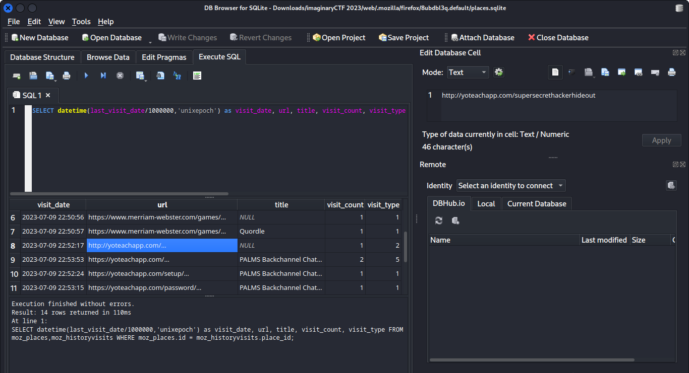

# web

## Deskripsi
We recovered this file from the disk of a potential threat actor. Can you find out what they were up to?

## Attachment
[web.zip](./Challenge/web.zip)

## Solusi
File zip tersebut berisi sebuah profile dari browser Firefox.
Langkah pertama adalah dengan mengamati mengenai history, bookmarks, dan download dari profile Firefox tersebut. Karena file yang akan diamati berupa sebuah database sqlite, maka digunakan tool `sqlitebrowser` untuk membukanya.

Link [berikut](https://book.hacktricks.xyz/generic-methodologies-and-resources/basic-forensic-methodology/specific-software-file-type-tricks/browser-artifacts) memberikan informasi mengenai digital forensic untuk profile dari sebuah browser.
Entri tentang history, bookmark, dan download terdapat pada file `places.sqlite`. Untuk melihat history digunakan query sql berikut ini.

```sql
SELECT datetime(last_visit_date/1000000,'unixepoch') as visit_date, url, title, visit_count, visit_type FROM moz_places,moz_historyvisits WHERE moz_places.id = moz_historyvisits.place_id;
```

Dari query sql tersebut terdapat history yang cukup menarik seperti ditunjukkan pada gambar di bawah.



Kolom `visit_type` menunjukkan bagaimana user mengunjungi link atau URL yang ada pada history. Disini terdapat URL http://yoteachapp.com/supersecrethackerhideout yang menunjukkan `visit_type` dengan indikator angka 2 yang menandakan user mengetik link atau URL tersebut. Kemungkinan terdapat flag di dalamnya.
Namun saat URL tersebut dibuka kita harus memasukkan password untuk mengetahui isi dari URL tersebut.

Kemudian dilakukan pengecekan pada file `formhistory.sqlite` yang merupakan history dari form data, dimana mungkin user memasukkan password dengan cara mengetik pada form password URL tersebut, namun tidak menunjukkan adanya history dari form data.
Ada satu file lagi yang bisa dicek, yaitu file `logins.json` yang merupakan entri dari saved password yang ada pada browser Firefox. File tersebut berisi username dan password yang sudah terenkripsi dan untungnya pada profile browser tersebut terdapat file `key4.db` yang bisa digunakan untuk mendekripsi username dan password yang tersimpan pada file `logins.json`.

Untuk mendapatkan saved password dari `logins.json` digunakan link [berikut](https://support.mozilla.org/en-US/kb/recovering-important-data-from-an-old-profile#).
Untuk menghindari kehilangan data pada profile Firefox yang sudah ada, maka dibuat profile baru terlebih dahulu.
Setelah selesai membuat profile baru, tutup Firefox. Copy paste file `logins.json` dan `key4.db` ke folder profile yang sudah dibuat sebelumnya.
Untuk membuka Firefox dengan profile baru yang sudah dibuat, jalankan command berikut pada terminal dan pilih user profile yang baru dibuat.

```
firefox -P
```

Langkah selanjutnya adalah mengunjungi link http://yoteachapp.com/supersecrethackerhideout dan karena kita sudah menyalin file `logins.json` dan `key4.db` maka password sudah langsung terisi.
Setelah masuk pada link tersebut, dilakukan pencarian flag dan ditemukan flag seperti berikut ini.


## Flag
### ictf{behold_th3_forensics_g4untlet_827b3f13}
