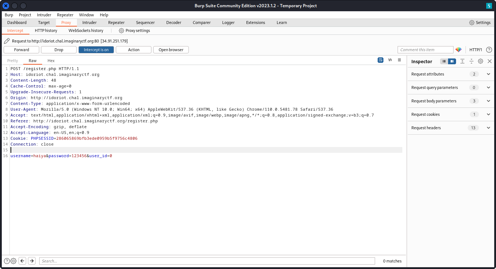

# Idoriot

## Deskripsi

Some idiot made this web site that you can log in to. The idiot even made it in php. I dunno.

http://idoriot.chal.imaginaryctf.org

## Solusi
Halaman awal yang diberikan menunjukkan halaman login seperti berikut.


Untuk bisa login, kita buka terlebih dahulu laman register untuk mendaftar akun dan login ke web challenge.


Setelah login kita diberikan sebuah source code PHP seperti berikut.

```php
<?php

session_start();

// Check if user is logged in
if (!isset($_SESSION['user_id'])) {
    header("Location: login.php");
    exit();
}

// Check if session is expired
if (time() > $_SESSION['expires']) {
    header("Location: logout.php");
    exit();
}

// Display user ID on landing page
echo "Welcome, User ID: " . urlencode($_SESSION['user_id']);

// Get the user for admin
$db = new PDO('sqlite:memory:');
$admin = $db->query('SELECT * FROM users WHERE user_id = 0 LIMIT 1')->fetch();

// Check if the user is admin
if ($admin['user_id'] === $_SESSION['user_id']) {
    // Read the flag from flag.txt
    $flag = file_get_contents('flag.txt');
    echo "<h1>Flag</h1>";
    echo "<p>$flag</p>";
} else {
    // Display the source code for this file
    echo "<h1>Source Code</h1>";
    highlight_file(__FILE__);
}

?>
```

Berdasarkan source code tersebut kita dapat mendapatkan flag yang dicari dengan cara mengubah nilai `user_id` menjadi 0.
Untuk itu digunakan bantuan `burpsuite` untuk intercept web request dan mengganti `user_id` menjadi 0.
Kita harus mendaftarkan kembali akun baru untuk login melalui web proxy yang sudah diatur pada `burpsuite`.
Ketika klik tombol Register, kita akan mendapatkan HTTP request yang berhasil di intercept oleh `burpsuite`. Ganti nilai `user_id` dengan 0, kemudian klik Forward untuk meneruskan request.



Setelah itu akan didapatkan flag seperti berikut ini.


## Flag
### ictf{1ns3cure_direct_object_reference_from_hidden_post_param_i_guess}