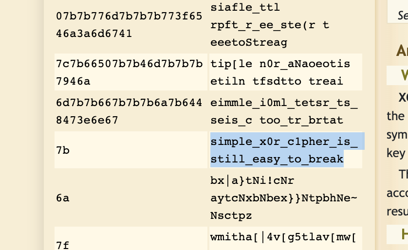

# Bit Level Crypto

## Deskripsi
Diberikan ciphertext berikut:
`0812160b171e24034b0924184a0b131e0924120824080f121717241e1a0802240f142419091e1a10`

## Solusi
Dilakukan dekripsi XOR Cipher secara bruteforce dengan [XOR decoder](https://www.dcode.fr/xor-cipher). 
Didapatkan plaintext berikut dari key ‘7b’:

## Flag
### KMIPN{simple_x0r_c1pher_is_still_easy_to_break}
