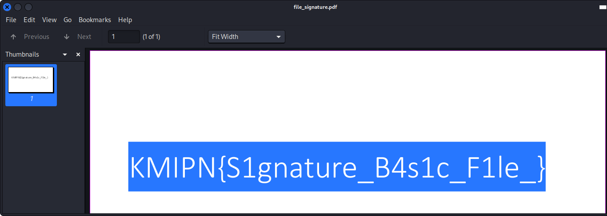

# Basic File Signature

## Deskripsi
[cari_flag_nya.zip](./Challenge/cari_flag_nya.zip)

## Solusi
File yang diberikan memiliki format .zip, tetapi ketika dicek signature file dari file tersebut bukan merupakan file zip.

```bash
xxd cari_flag_nya.zip | head
```


Menurut Wikipedia [berikut](https://en.wikipedia.org/wiki/List_of_file_signatures) kita bisa membetulkan file signature dari zip, yaitu `504b0304`. 
Karena yang rusak adalah hex data pada byte 0 dan 1, maka hex data tersebut bisa dibetulkan menggunakan hex editor. Sebagai contoh disini digunakan vim sebagai hex editor.


Setelah membetulkan file signature di dalam file zip tersebut terdapat file PDF yang berisi flag.



## Flag
### KMIPN{S1gnature_B4s1c_F1le}