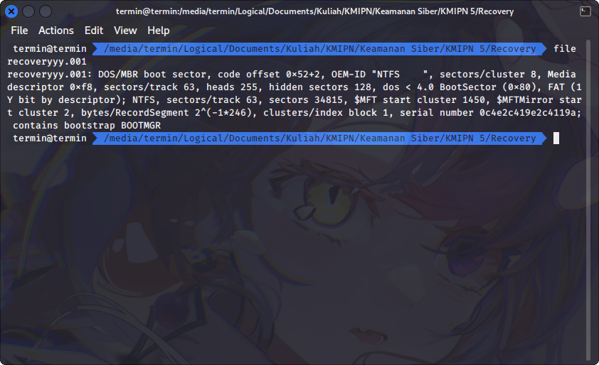
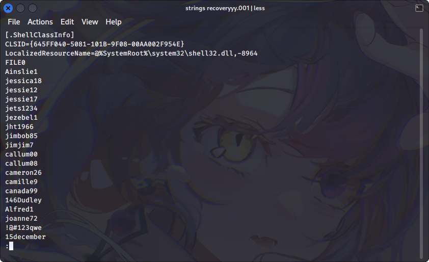
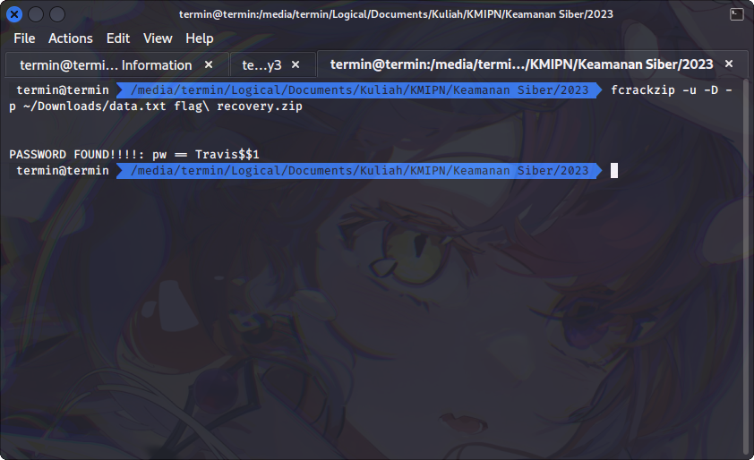

# Recovery

## Deskripsi
Penyimpanan Drive tersangka sudah di tanganin pihak keamanan.. dan Drive sudah
dijadikan file image, sesuai dengan proses penanganan forensic.

- Tetapi File yang dicari ternyata ber password.
- Menurut tersangka password ada di dalam wordlist yang sudah dia delete
- dapatkah kamu recovery file wordlist tersebut dan membuka file nya..

File download
https://drive.google.com/drive/folders/14IRms9sUNpFWjD7rX13Ia5Lv5ggMb9uG?usp=sharing

## Attachment
[recoveryyy.001](./Challenge/recoveryyy.001)

## Solusi
Karena tidak diketahui format file apa yang diberikan, maka digunakan command file untuk melihat jenis file tersebut.

```bash
file recoveryyy.001
```



Berdasarkan hasil dari command file diketahui bahwa file yang diberikan merupakan file disk NTFS. Kemudian dicoba untuk mount disk tersebut menggunakan command berikut

```bash
sudo mount -t ntfs -o stream_interfaces=windows "recoveryyy.001" "/tmp/mnt"
```

Setelah disk tersebut di-mount terdapat sebuah file zip yang didalamnya terdapat file PDF yang sudah dilock dan juga terdapat Recycle bin namun di dalam Recycle bin tersebut tidak terdapat informasi mengenai password yang bisa digunakan untuk membuka file PDF tersebut.

Dari deskripsi soal terdapat petunjuk untuk merecover wordlist yang bisa digunakan untuk bisa membuka file zip.
Disini kami menggunakan cara yang cukup sederhana tapi sedikit sulit, yaitu digunakan command strings untuk melihat isi dari disk NTFS tersebut dan memilih secara manual dari output command strings yang terlihat seperti wordlist.

```bash
strings recoveryyy.001 | less
```



Setelah memilih secara manual wordlist yang terdapat pada file recoveryyy.001 menggunakan command strings, selanjutnya digunakan tool cracking zip `fcrackzip` untuk melakukan bruteforce password yang digunakan untuk mengunci file zip tersebut.

```bash
fcrackzip -u -D -p ~/Downloads/data.txt flag\ recovery.zip
```



Setelah di crack terdapat file PDF yang berisikan flag seperti berikut ini.


## Flag
### KMIPN{recovery_cracking_zip_basic}