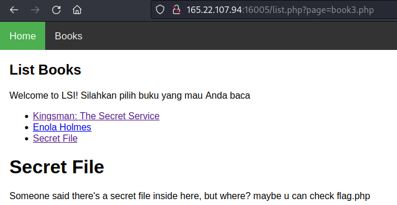
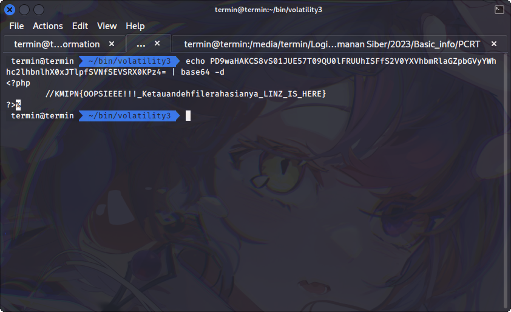

# WEB LSI

## Deskripsi
I made a library website you can read book here, maybe can you read the index.php?
I think there's some secret there http://165.22.107.94:16005

## Solusi
Halaman yang pada challenge ini memiliki menu Books yang bisa digunakan untuk
menampilkan seluruh buku, disini koleksi buku berupa file php. Jika kita buka entry
Secret File akan ada tampilan seperti berikut ini.




Untuk mendapatkan flag kita harus membaca file `flag.php`, namun file tersebut
sepertinya isinya di comment sehingga tidak tampil pada layar. Lalu bagaimana
untuk membaca file tersebut?
Disini vulnerability dari web tersebut yang berhasil kami identifikasi merupakan LFI
(Local File Inclusion) yang mampu melihat file dan mengeksekusi command pada sisi
server. Penjelasan lengkap pada link [berikut](https://book.hacktricks.xyz/pentesting-web/file-inclusion).

Disini kita bisa mendapatkan file `flag.php` dengan bantuan php wrapper, contohnya
disini digunakan php wrapper untuk mengencoding isi dari file flag.php menjadi
base64. Payload yang digunakan seperti berikut ini.
```
http://165.22.107.94:16005/list.php?page=php://filter/convert.base64-encode/resource=flag.php
```


Selanjutnya kita hanya perlu untuk mendecode output berupa base64 seperti berikut
ini.



## Flag
### KMIPN{OOPSIEEE!!!_Ketauandehfilerahasianya_LINZ_IS_HERE}