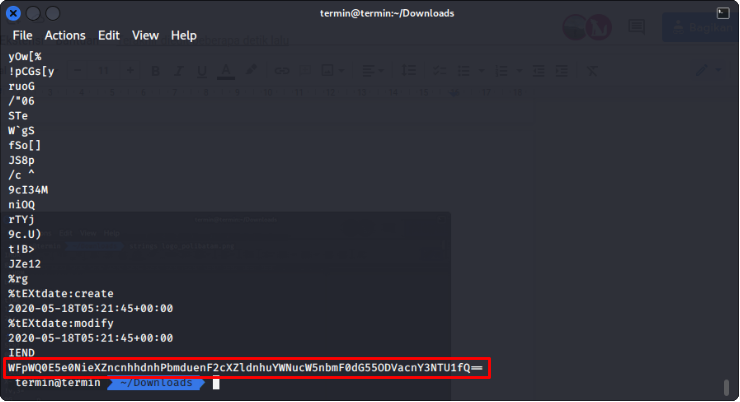

# Exam Answer

## Deskripsi
Budi ingin mengetahui jawaban yang pernah diujikan pada saat UAS kepada Caesar. Tetapi Caesar hanya memberikan sebuah gambar. Bisakah anda membantu Budi untuk mengetahui apa yang sebenarnya Caesar berikan?

## Solusi
Diberikan sebuah file gambar [berikut](./Challenge/logo_polibatam.png) yang merupakan file png. Pertama cek nilai string yang kemungkinan di dalamnya terdapat flag.
``` shell
strings logo_polibatam.png
```
Pada hasil pengecekan string dari gambar ada informasi yang bisa didapat, yaitu adanya teks setelah chunk IEND.

Menurut informasi dari [Wikipedia](https://en.wikipedia.org/wiki/Portable_Network_Graphics) chunk IEND adalah bagian terakhir dari gambar png.

Jika terdapat teks yang disisipkan setelah chunk IEND kemungkinan itu adalah flag yang dicari. Teks setelah chunk tersebut seperti telah di-encode menggunakan base64.
**WFpWQ0E5e0NieXZncnhhdnhPbmduenF2cXZldnhuYWNucW5nbmF0dG55ODVacnY3NTU1fQ==**

Decoding base64 dengan perintah berikut
``` shell
echo "WFpWQ0E5e0NieXZncnhhdnhPbmduenF2cXZldnhuYWNucW5nbmF0dG55ODVacnY3NTU1fQ==" | base64 -d
```
Hasilnya didapatkan teks **XZVCA9{CbyvgrxavxOngnzqvqvevxnacnqngnattny85Zrv7555}**

Namun informasi yang telah di-decode tidak sesuai dengan format flag yang ada yaitu **KMIPN4{flag}**. Untuk itu mencoba untuk menggunakan ROT13 karena pada deskripsi soal masih mencantumkan nama Caesar. 

Hasilnya menjadi **KMIPN9{PoliteknikBatamdidirikanpadatanggal85Mei7555}**.

Informasi yang diperoleh sudah mendekati flag yang kita cari, namun hasil pencarian menunjukkan Politeknik Negeri Batam didirikan pada 30 Mei 2000. Sehingga flagnya menjadi **KMIPN4{PoliteknikBatamdidirikanpadatanggal30Mei2000}**

## Flag
### KMIPN4{PoliteknikBatamdidirikanpadatanggal30Mei2000}
