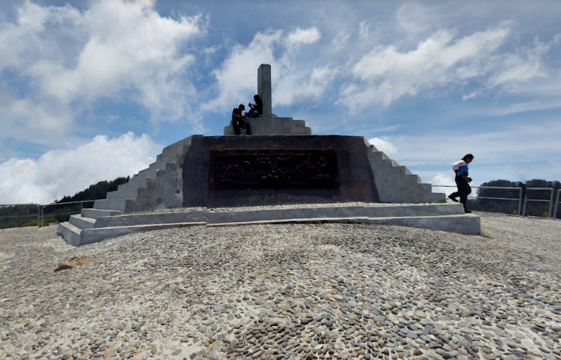
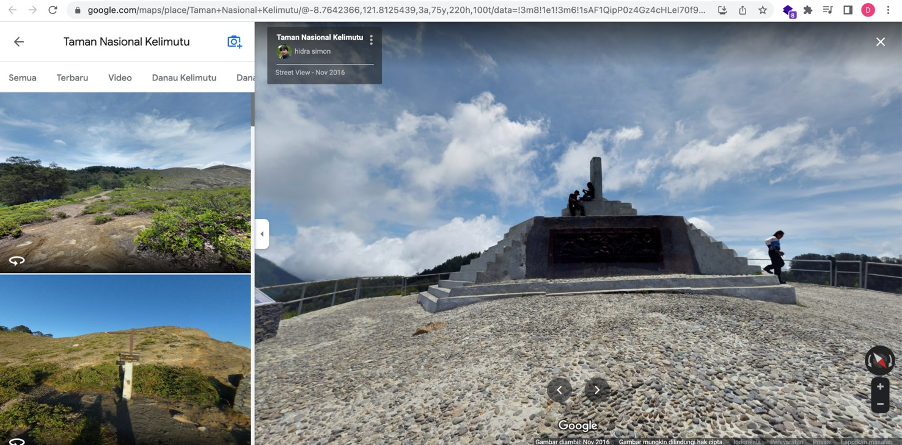

# Panorama

## Deskripsi
2 Foto Pemandangan yang diambil dari satu titik.

Format Flag : KMIPN4{latitude_longitude}
Contoh : KMIPN4{-1.179_2.245}

Catatan : Nilai latitude dan longitude dibulatkan ke 3 angka desimal.

## Solusi
Pada instrukti tercantum 2 file gambar. Yang di mana kedua file tersebut bergambar suatu pemandangan dan tercantum bahwa pemandangan diambil dari satu titik yang. Ketika diamati bahwa kedua gambar tersebut berada pada Taman Nasional Kelimutu di Tugu Puncak Kelimutu. Kami mengindikasikan gambar tersebut berasal dari Google Street View. Setelah kami mencari-cari dan didapatkan gambar yang sama persis dengan file yang diberikan, akhirnya kami menyimpulkan posisi pengambilan adalah sama. Setelah itu kami melakukan pengecekan pada url yaitu https://www.google.com/maps/place/Taman+Nasional+Kelimutu/@-8.7642366,121.8125439,3a,75y,220h,100t/data=!3m8!1e1!3m6!1sAF1QipP0z4Gz4cHLeI70f9_kpfqQXrgnYi2LzHTS9fis!2e10!3e11!6shttps:%2F%2Flh5.googleusercontent.com%2Fp%2FAF1QipP0z4Gz4cHLeI70f9_kpfqQXrgnYi2LzHTS9fis%3Dw203-h100-k-no-pi-10-ya354.50186-ro-0-fo100!7i6144!8i3072!4m11!1m2!2m1!1sTugu+puncak+Kelimutu!3m7!1s0x0:0xb92c1d43de87b7b3!8m2!3d-8.7415482!4d121.7936207!14m1!1BCgIgARICCAI!15sChRUdWd1IHB1bmNhayBLZWxpbXV0dVoWIhR0dWd1IHB1bmNhayBrZWxpbXV0dZIBDW5hdGlvbmFsX3BhcmuaASNDaFpEU1VoTk1HOW5TMFZKUTBGblNVUlphQzFEYVVsM0VBRQ. Terdapat latitude dan longitude -8.7642366,121.8125439. Kami sederhanakan hanya menjadi 3 desimal yaitu -8.764 dan 121.813. Dan itulah flagnya

## Flag
### KMIPN4{-8.764_121.813}
