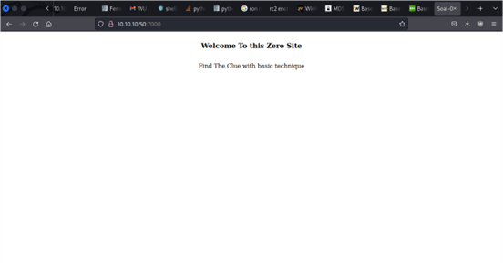
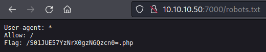
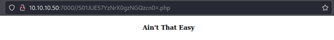

# Hide Me from Search Engine!

## Deskripsi
Ada sebuah halaman yang disembunyikan dari mesin pencari. 
http://10.10.10.50:7000 

## Solusi
Website tersebut ketika dibuka hanya menampilkan tampilan seperti berikut ini. 

Penelusuran lebih lanjut dilakukan untuk mencari kemungkinan adanya flag. Setelah dilakukan proses inspect element, menelusuri cookies, dan melihat response dan request dari website tersebut tidak terlalu banyak informasi. Kemudian kami melihat lagi dari judul challenge tersebut, dimana judulnya menyiratkan bahwa website tersebut sengaja untuk disembunyikan dari search engine. Salah satu cara untuk menyembunyikan website dari crawling search engine adalah dengan menerapkan robots.txt. File robots.txt akan memberitahukan bagian mana saja di dalam suatu website yang bisa di crawling oleh search engine. Kami kemudian membuka robots.txt dari website tersebut. 

Informasi flag berada pada path tersebut. Kami mencoba untuk membuka path tersebut tetapi hanya muncul tampilan seperti berikut ini. 

## Flag
### KMIPN4{z3r0_s1t3_numb3r_z3r0}
