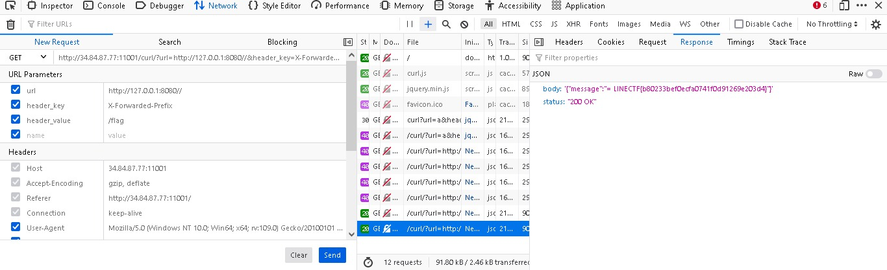

# Adult Simple GoCurl

## Deskripsi
Read the flag (/flag)

## Solusi
Challenge yang mirip dengan Baby Simple GoCurl, namun terdapat perbedaan cara dari program untuk melakukan pengecekan pada method GET untuk `/curl`.

```go
if strings.Contains(reqUrl, "flag") || strings.Contains(reqUrl, "curl") || strings.Contains(reqUrl, "%") {
			c.JSON(http.StatusBadRequest, gin.H{"message": "Something wrong"})
			return
		}
```

Dari potongan source code di atas, maka request ke server akan dicek apakah mengandung `flag`, `curl`, atau `%`. Karena pada program ini tidak ada pengecekan untuk IP address yang melakukan request adalah `127.0.0.1` maka request untuk IP address `http://127.0.0.1:8080/` masih bisa untuk langsung dimasukkan pada parameter `url`.

Untuk mendapatkan flag, dapat memanfaatkan header `X-Forwarded-Prefix` yang mana pada link [berikut](https://github.com/gin-gonic/gin/pull/3500) menunjukkan bahwa request menggunakan header tersebut ketika dimodifikasi sedemikian rupa akan memungkinkan untuk membuat unintended request yang bisa dieksploitasi. 

Karena flag berada pada `/flag` yang hanya bisa diakses oleh localhost, maka dengan memanfaatkan fitur `X-Forwarded-Prefix` akan mengubah redirect yang seharusnya kita tidak bisa melihat isi dari `/flag` akan membuat kita dapat melihat isi flag. Request yang digunakan seperti berikut ini.

```
GET http://34.84.87.77:11001/curl/?url=http://127.0.0.1:8080//&header_key=X-Forwarded-Prefix&header_value=/flag
```



## Flag
### LINECTF{b80233bef0ecfa0741f0d91269e203d4}
