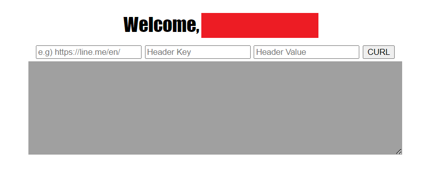
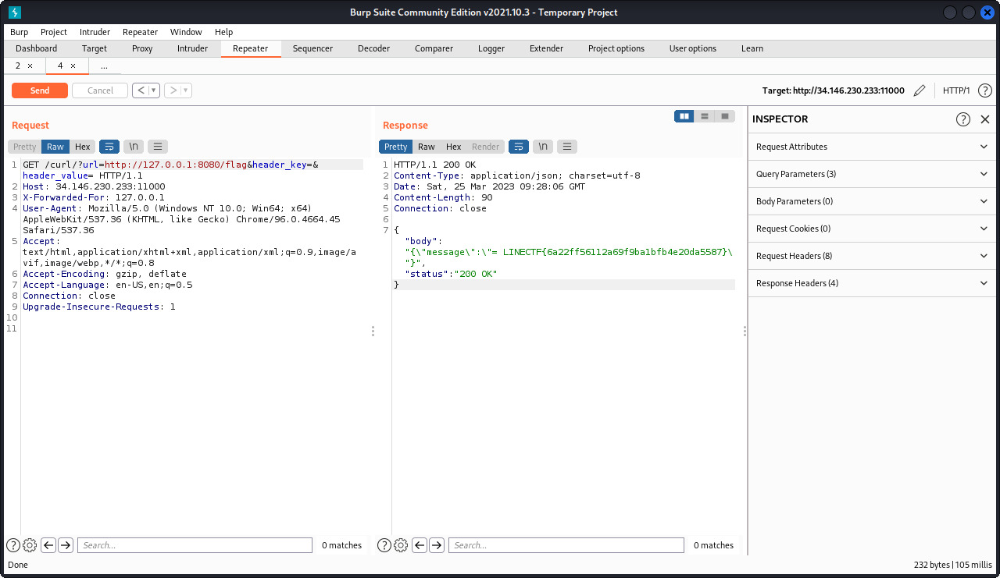

# Baby Simple GoCurl

## Deskripsi
Read the `/flag`

## Solusi
Pada challenge ini diberikan source code yang bisa dicoba di local. Tampilan dari website seperti ini.



Disini jika melihat pada file `main.go` terdapat object yang menunjukkan method `HTTP GET` untuk page `/curl`. 
```go
r.GET("/curl/", func(c *gin.Context) {
		client := &http.Client{
			CheckRedirect: func(req *http.Request, via []*http.Request) error {
				return redirectChecker(req, via)
			},
		}

		reqUrl := strings.ToLower(c.Query("url"))
		reqHeaderKey := c.Query("header_key")
		reqHeaderValue := c.Query("header_value")
		reqIP := strings.Split(c.Request.RemoteAddr, ":")[0]
		fmt.Println("[+] " + reqUrl + ", " + reqIP + ", " + reqHeaderKey + ", " + reqHeaderValue)

		if c.ClientIP() != "127.0.0.1" && (strings.Contains(reqUrl, "flag") || strings.Contains(reqUrl, "curl") || strings.Contains(reqUrl, "%")) {
			c.JSON(http.StatusBadRequest, gin.H{"message": "Something wrong"})
			return
		}

		req, err := http.NewRequest("GET", reqUrl, nil)
		if err != nil {
			c.JSON(http.StatusBadRequest, gin.H{"message": "Something wrong"})
			return
		}

		if reqHeaderKey != "" || reqHeaderValue != "" {
			req.Header.Set(reqHeaderKey, reqHeaderValue)
		}

		resp, err := client.Do(req)
		if err != nil {
			c.JSON(http.StatusBadRequest, gin.H{"message": "Something wrong"})
			return
		}

		defer resp.Body.Close()

		bodyText, err := ioutil.ReadAll(resp.Body)
		if err != nil {
			c.JSON(http.StatusBadRequest, gin.H{"message": "Something wrong"})
			return
		}
		statusText := resp.Status

		c.JSON(http.StatusOK, gin.H{
			"body":   string(bodyText),
			"status": statusText,
		})
	})
```
Sekilas yang dapat diamati dari potongan source code di atas adalah:
- Untuk mengakses path `/flag` harus memiliki IP address `127.0.0.1`.
- Jika IP address bukan `127.0.0.1` dan request yang diberikan mengandung `flag`, `curl`, atau `%` akan muncul error.
- Hanya memasukkan `url=http://127.0.0.1:8080/flag` pada request tidak akan memberikan flag yang dicari, karena pada program menggunakan `ClientIP()` yang mengecek IP address real dari remote machine yang mengakses web. Referensinya ada pada link [berikut](https://pkg.go.dev/github.com/gin-gonic/gin#Context.ClientIP)
- Parameter `header_key` dan `header_value` harus kosong.

Selanjutnya pada potongan source code berikut ini, yaitu potongan source code yang menangani request untuk `/flag` menunjukkan untuk mengaksesnya IP address harus `127.0.0.1`
```go
r.GET("/flag/", func(c *gin.Context) {
		reqIP := strings.Split(c.Request.RemoteAddr, ":")[0]

		log.Println("[+] IP : " + reqIP)
		if reqIP == "127.0.0.1" {
			c.JSON(http.StatusOK, gin.H{
				"message": flag,
			})
			return
		}

		c.JSON(http.StatusBadRequest, gin.H{
			"message": "You are a Guest, This is only for Host",
		})
	})
```

Berdasarkan kedua potongan source code tadi, untuk mendapatkan flag maka IP address dari device yang kita gunakan harus `127.0.0.1`.
Untuk itu bisa menggunakan HTTP header `X-Forwarded-For: 127.0.0.1` untuk menunjukkan IP address adalah `127.0.0.1` ketika mengakses web server. Penjelasan lengkapnya ada pada link [berikut](https://developer.mozilla.org/en-US/docs/Web/HTTP/Headers/X-Forwarded-For).

Penyelesaiannya adalah dengan membuat request `HTTP GET` dengan nilainya adalah `/curl/?url=http:127.0.0.1:8080/flag&header_key=&header_value="` disertai header `X-Forwaded-For:127.0.0.1`.
Port `8080` adalah port dari web tersebut jika kita menjalankannya pada local.
Contohnya seperti berikut ini.



## Flag
### LINECTF{6a22ff56112a69f9ba1bfb4e20da5587}


