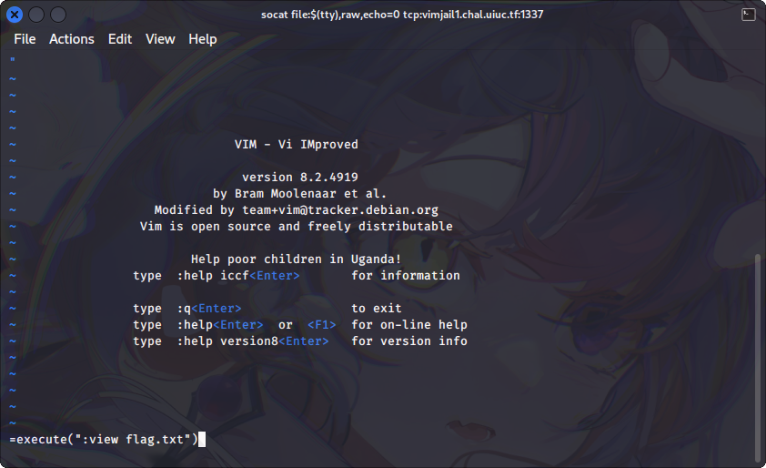

# vimjail1

## Deskripsi

Connect with `socat file:$(tty),raw,echo=0 tcp:vimjail1.chal.uiuc.tf:1337`. You may need to install socat.

## Attachment
[Dockerfile](./Challenge/Dockerfile)
[entry.sh](./Challenge/entry.sh)
[nsjail.cfg](./Challenge/nsjail.cfg)
[vimrc](./Challenge/vimrc)

## Solusi
Challenge ini yang diberikan berupa sebuah environment vim yang terdapat restriction di dalamnya.
Pertama kita lihat terlebih dahulu isi dari `entry.sh`

```sh
#!/usr/bin/env sh

chmod -r /flag.txt

vim -R -M -Z -u /home/user/vimrc
```

Program bash shell tersebut akan menjalankan perintah seperti ini:
- Mengubah file permission dari flag.txt
- Menjalankan vim dengan read-only mode `-R`, not modifiable mode `-M`, restricted mode `-Z`, dan menjalankan vim dengan konfigurasi dari `/home/user/vimrc`.
Yang perlu diperhatikan dari menjalankan vim dengan options di atas adalah kita tidak bisa mengedit menggunakan vim dan juga tidak bisa membuka terminal atau bash shell dari dalam vim karena dijalankana pada restricted mode.

Selanjutnya mari kita lihat isi dari konfigurasi dari `vimrc`

```
set nocompatible
set insertmode

inoremap <c-o> nope
inoremap <c-l> nope
inoremap <c-z> nope
inoremap <c-\><c-n> nope
```

Dari file konfigurasi `vimrc` tersebut terdapat point yang harus diperhatikan:
- Vim otomatis akan dijalankan pada insert mode, dapat dilihat dari `set insertmode`
- inoremap artinya adalah menggantikan mapping key dalam insert mode, yaitu untuk `Ctrl-o`, `Ctrl-l`, `Ctrl-z`, dan `Ctrl-\ Ctrl-n` dengan nope. Artinya tidak bisa keluar dari insert mode menggunakan beberapa mapping tersebut.

Jika tidak bisa keluar dari insert mode, maka kita tidak bisa menjalankan command vim yang ada pada normal mode. 
Namun disini ada sedikit trik, dimana kita bisa mengeksekusi [builtin function vim](https://vimhelp.org/builtin.txt.html) melalui register saat di dalam insert mode. Untuk pengertian dari register sendiri bisa dicari artinya dengan searching pada Google.
Untuk memasukkan register diawali dengan menekan `Ctrl-r`, kemudian untuk menjalankan builtin function, maka masukkan `=` diikuti dengan builtin function yang akan dijalankan. Disini builtin function yang akan dijalankan adalah `execute()` dimana fungsinya adalah menjalankan fungsi dari command yang ada di vim. Contohnya seperti berikut ini.



Saat menjalankan `execute(":view flag.txt")` seperti di atas maka akan muncul error, namun saat ditekan enter akan menampilkan isi dari flag.txt


## Flag
### uiuctf{n0_3sc4p3_f0r_y0u_8613a322d0eb0628}