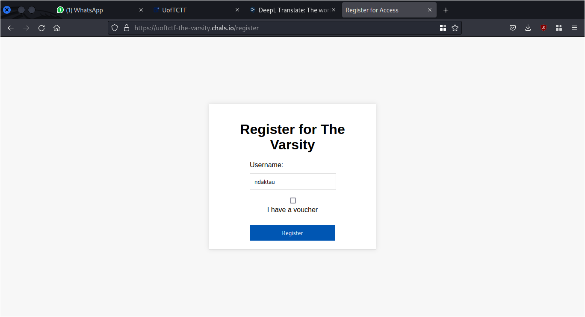
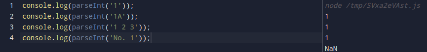

# The Varsity

## Description
Come read our newspaper! Be sure to subscribe if you want access to the entire catalogue, including the latest issue.

Author: SteakEnthusiast

`uoftctf-the-varsity.chals.io`

## Attachment
[the_varsity.zip](./Challenge/the_varsity.zip)

## Solution
The webpage of the provided challenge is a webpage that displays articles in it. To be able to see the article, we must register an account on the webpage. When registering, there is an optional voucher (possibly for premium users).



For more details, we can look at the source code for the registration process.

```js
app.post("/register", (req, res) => {
  const { username, voucher } = req.body;

  if (
    typeof username === "string" &&
    (!voucher || typeof voucher === "string")
  ) {
    const subscription = voucher === FLAG + JWT_SECRET ? "premium" : "guest";
    if (voucher && subscription === "guest") {
      return res.status(400).json({ message: "Invalid voucher" });
    }
    const userToken = jwt.sign({ username, subscription }, JWT_SECRET, {
      expiresIn: "1d",
    });
    res.cookie("token", userToken, { httpOnly: true });
    return res.json({ message: "Registration successful", subscription });
  }

  return res.status(400).json({ message: "Invalid username or voucher" });
});
```

To register as a premium user we need to enter a voucher whose value is equivalent to the value of the flag and the value of the JSON Web Token (JWT), which is not possible because we do not know the flag of this challenge.

For now, we will register as a guest user and see the articles that can be read as a guest user.
We can't read the content of article 10, I think this is the article that has the flag in it.


```js
const articles = [
    ...
    {
    title: "UofT Hosts its 2nd Inaugural Capture the Flag Event",
    content: "Your flag is: " + FLAG,
  },
];
```

Then let's take a look at the source code how a user are authenticated to read an article.

```js
app.post("/article", (req, res) => {
  const token = req.cookies.token;

  if (token) {
    try {
      const decoded = jwt.verify(token, JWT_SECRET);

      let issue = req.body.issue;

      if (req.body.issue < 0) {
        return res.status(400).json({ message: "Invalid issue number" });
      }

      if (decoded.subscription !== "premium" && issue >= 9) {
        return res
          .status(403)
          .json({ message: "Please subscribe to access this issue" });
      }

      issue = parseInt(issue);

      if (Number.isNaN(issue) || issue > articles.length - 1) {
        return res.status(400).json({ message: "Invalid issue number" });
      }

      return res.json(articles[issue]);
    } catch (error) {
      res.clearCookie("token");
      return res.status(403).json({ message: "Not Authenticated" });
    }
  } else {
    return res.status(403).json({ message: "Not Authenticated" });
  }
});
```

We can see that there's JWT verification, it seems that altering or forging the JWT is not possible.
Then let's take a look at this code.

```js
if (decoded.subscription !== "premium" && issue >= 9) {
        return res
          .status(403)
          .json({ message: "Please subscribe to access this issue" });
      }

      issue = parseInt(issue);
```

From that code we can see that, if the user is not premium user and the the article issue is equal or more than 9, then we can't read the content of article that contain a flag.
But there's something interesting in the next line. The value of `issue` is converted to integer using `parseInt()` function.
`parseInt()` is a function to convert string to integer, it will return an integer value if the input contain any number and it will return NaN if the input doesn't contain any number or the first value of the input is not a number.
By using `parseInt()` it's really convenient to convert any string value to integer, but there will be some unexpected behavior if the input value starts with a number but the rest is not a number. `parseInt()` will consider it as an integer and omit the remaining string that are not numbers.
Let's take a look in this example for more clear explaination.



As you can see from the example, any string that starts with 1 will be converted to 1 by using `parseInt()` even though the input isn't exactly the same.

By leveraging this unexpected behavior we can attempt to authenticate by modifying the value of the `issue` variable. In this example I'm using this value to read the content of article number 10.

```
{"issue":"9 2"}
```

You can use Burpsuite to modify the request parameter in the body to gain a read access. 
Resending the request by modifying the issue value in the Firefox browser will not work.


## Flag
`uoftctf{w31rd_b3h4v10r_0f_parseInt()!}`