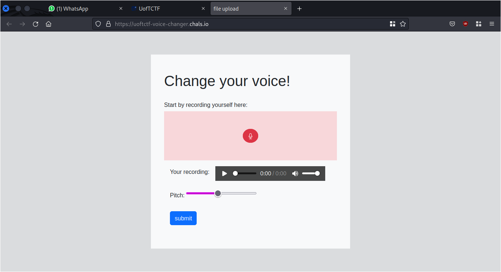
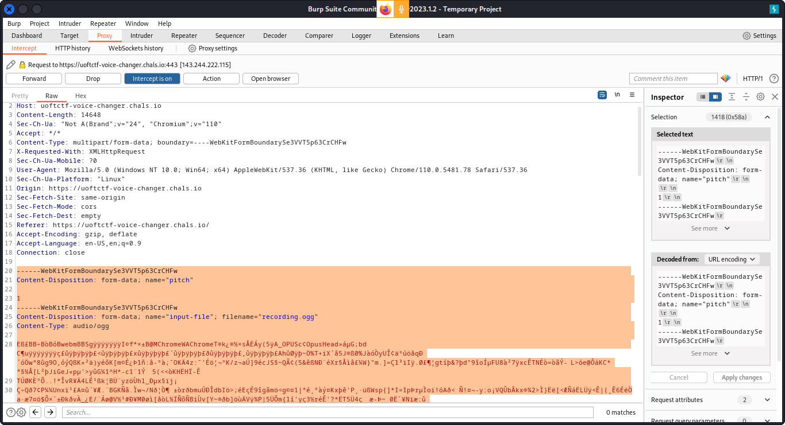
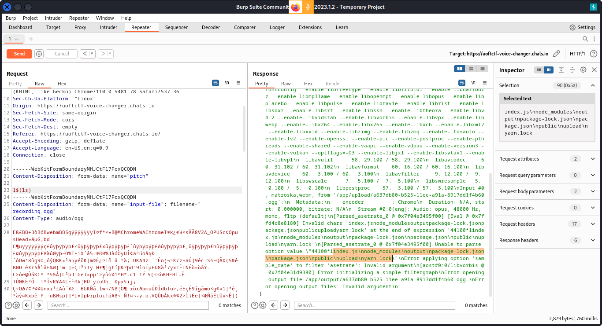

# Voice Changer

## Description
I made a cool app that changes your voice.

Author: Ido

https://uoftctf-voice-changer.chals.io/ 

## Solution
This challenge is a web that is capable of recording a voice and changing the pitch of the recorded voice.



After submitting the audio, there will be `ffmpeg` command which is used to change the pitch of the audio.


After further investigation using Burpsuite, the parameter for pitch is vulnerable to OS command injection.



Now let's try to see the list of all files and directories in current directories.

```
1$(ls)
```



From the results, there is no sign of the flag file being searched for. Let's try to see all files and directories in root directory.

```
1$(ls -a /)
```


From the results of `ls -a /` command, the `secret.txt` file is probably the flag that we are looking for. To get the flag, run the following command.

```
1$(cat ../secret.txt)
```


## Flag
`uoftctf{Y0UR Pitch IS 70O H!9H}`