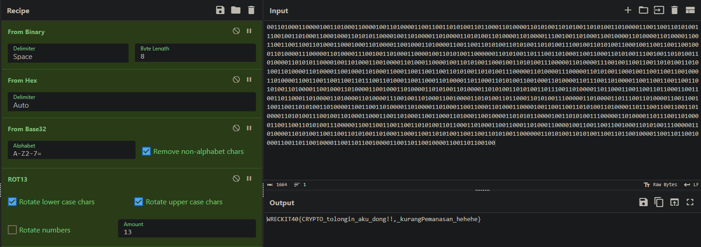

# CRYPTO Free Flag

## Deskripsi
Seorang NPC pergi ke Lawang Sewu dan mendapati suatu pintu dengan tulisan seperti password. Ada palang bertuliskan Bi UNTUK BINERRRRR!!! password is BiHB32R13

## Solusi
Diberikan sebuah soal yang isinya adalah bilangan biner [Challenge](Challenge/soal.secret). Digunakan [CyberChef](https://gchq.github.io/CyberChef/) untuk decode pesan bilangan biner tersebut. Hasil setelah di-decode adalah pesan yang di-encode menggunakan hexadecimal. Hasil dari decode pesan hexadecimal adalah pesan yang di encode mirip dengan base64, namun jika dicermati semua encoding menggunakan huruf kapital. Itu artinya pesan tersebut di-encode menggunakan base32. Hasil decoding dari pesan base32 menunjukkan pesan seperti di encode menggunakan Caesar cipher. Kemudian dilihat kembali dari deskripsi soal, “password is BiHB32R13”, yang dimana password tersebut seperti mengisyaratkan cara untuk encoding pesan, dimulai dari binary, hexadecimal, base32, dan yang terakhir adalah rotate 13. Hasil akhir dari decoding pesan adalah berikut ini:

## Flag
### WRECKIT40{CRYPTO_tolongin_aku_dong!!,_kurangPemanasan_hehehe}