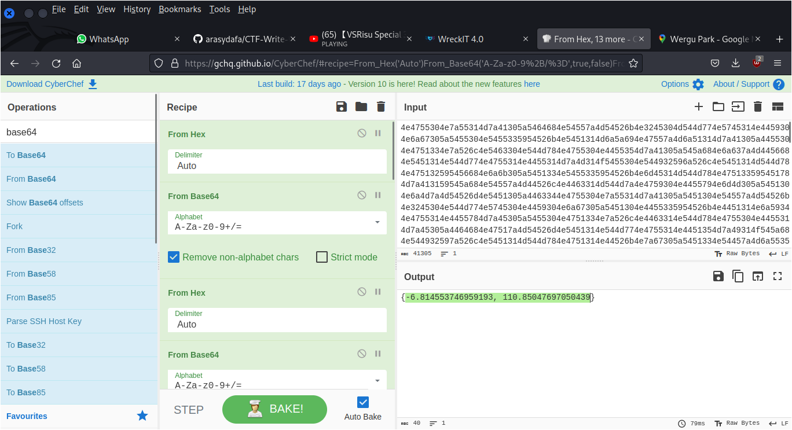

# Hide and Seek on Zero Day

## Deskripsi

Dawn bermain sebuah permainan yang sangat menyenangkan sekali bersama dengan teman terbaiknya di abad ini yaitu Snork. Permainan yang kita lakukan adalah petak umpet luar biasa dimana Snork akan bersembunyi di planet Bumi sedangkan tugas Dawn adalah mencari dimanakah Snork saat ini. Karena Dawn sangat pintar dia sebelumnya sudah menempelkan kamera dan alat pendeteksi koordinat di baju Snork. Kemudian sesaat sebelum kedua alat tersebut kehabisan data, alat itu meninggalkan beberapa data yang sangat berguna yang telah dia sembunyikan dalam secret note.

Sebelum itu, karena mereka berdua berteman baik, Dawn juga tahu bahwa Snork sangat suka meninggalkan pesan pada suatu tempat saat dia sedang bermain permainan. Dapatkah kamu mengetahui pesan yang ditinggalkan oleh Snork?

[park.jpg](./Challenge/park.jpg) [secret.txt](./Challenge/secret.txt)

## Solusi

Pada challenge ini diberikan 2 buah attachment, sebuah gambar taman dan sebuah file `secret.txt` yang isinya pesan di-encode menggunakan hexadecimal. Gambar tersebut ketika dicek tidak ada informasi yang menarik.

Isi file `secret.txt` dicoba untuk di-decode menggunakan [CyberChef](https://gchq.github.io/CyberChef/).
Hasilnya setelah di-decode muncul pesan yang di-encode menggunakan menggunakan base64. Dilakukan decoding lagi. Hasilnya muncul lagi encoding hexadecimal.

Dilakukan langkah di atas berkali-kali sampai di dapatkan koordinat seperti berikut ini.

Dilakukan pencarian pada Google Maps menggunakan koordinat tadi. Namun dari koordinat itu tidak ditemukan apa-apa. Disini aku teringat lagi dengan gambar taman yang diberikan pada challenge ini.
Dilakukan penelusuran pada taman di dekat area dengan koordinat tersebut.

Akhirnya ditemukan taman dengan gambar yang mirip dengan yang ada pada challenge, yaitu taman Wergu di daerah Kudus. Selanjutnya dilakukan pencarian review terbaru dan didapatkan flag seperti berikut ini.

## Flag
### WRECKIT40{0o0o0o0o0o0o0o0o0o0oo0pPpPpPpPpPpPpP5s5s55s5s5s5s5s5s5s5s5s5s5_Y0u_F1Nd_M3}