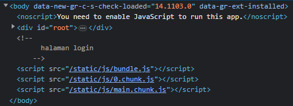
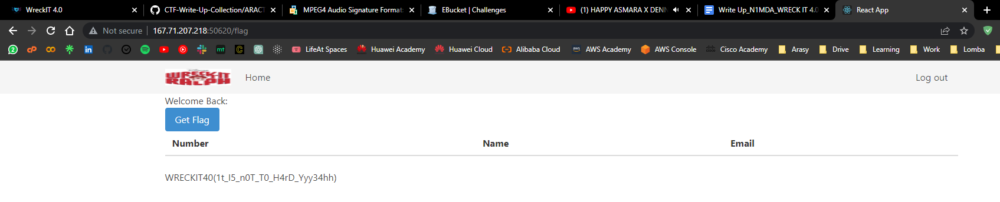

# jwtt

## Deskripsi
Masuklah dengan login

http://167.71.207.218:50620

## Solusi
Saat dibuka tampilan web hanya blank atau putih. Namun hal itu bukan pertanda bahwa web dalam kondisi down. Dilakukan pengecekan dengan inspect element. 

Terlihat bahwa ada file javascript yang bisa diulik dan dari title web tersebut menunjukkan bahwa web tersebut dibuat menggunakan ReactJS.
Pada isi dari App.js terdapat path /flag yang kemungkinan isinya adalah flag. Dan seperti yang kita tahu bahwa App.js sendiri sama seperti main program dari aplikasi yang dibuat menggunakan ReactJS. Dan setelah diakses /flag didapatkan flag yang dicari.

## Flag
### WRECKIT40(1t_I5_n0T_T0_H4rD_Yyy34hh)

