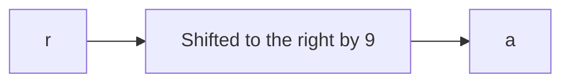

# ranch

## Deskripsi
Caesar dressing is so 44 BC...
```
rtkw{cf0bj_czbv_nv'cc_y4mv_kf_kip_re0kyvi_uivjj1ex_5vw89s3r44901831}
```

[ranch.py](./Challenge/ranch.py)

## Points
20

##
Challenge yang melibatkan rotation cipher atau Caesar cipher.
Program yang diberikan isinya seperti berikut ini

```python
import string

f = open("flag.txt").read()

encrypted = ""

shift = int(open("secret_shift.txt").read().strip())

for i in f:
    if i in string.ascii_lowercase:
        encrypted += chr(((ord(i) - 97 + shift) % 26)+97)
    else:
        encrypted += i

print(encrypted)
```

Terlihat bahwa nilai desimal ASCII dari suatu karakter akan dikurangi nilainya dengan 97 atau `a` kemudian dimodulus dengan karakter substitute kemudian ditambah dengan 97.
Lebih singkatnya jika kita tidak melihat pada program maka hanya perlu menggeser karakter pertama dari ciphertext, yaitu `r` ke karakter pertama dari format flag yaitu `a`. Karakter `r` ke `a` akan digesert atau dirotasi 9 kali, seperti berikut ini



Untuk mendapatkan flag, gunakan rot9.

## Flag
### actf{lo0ks_like_we'll_h4ve_to_try_an0ther_dress1ng_5ef89b3a44901831}