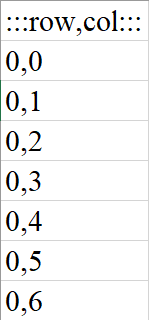
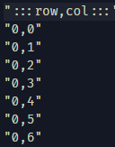

# QRazy CSV

## Deskripsi
A csv file contains a hidden surprise that will lead you to the next level. But it’s not easy to find. Can you uncover it and solve it? Author: noob_abhinav

## Attachment
[secret.csv](./Challenge/secret.csv)

## Solusi
Pada challenge ini terdapat sebuah file csv. Begitu kita melihat judul langsung terpikirkan bahwa challenge kali ini terdapat QR Code dalam file csv yang diberikan. Tetapi setelah dibuka menggunakan Excel, ternyata hanya terdapat satu kolom saja, padahal di csv tersebut sudah jelas terlihat bahwa seharusnya ada kolom `row` dan `col`. 

Kita mencoba membuka file csv tersebut menggunakan text editor, ternyata terdapat `double quotes` yang membuat Excel tidak mengenali bahwa seharusnya text tersebut merupakan csv.

Kita lalu melakukan replace terhadap semua `double quotes` dengan `empty string`. Ketika kita buka ulang melalui Excel, file tersebut sudah mempunyai dua kolom yaitu `row` dan `col`. Lalu kita memblok semua data pada file tersebut dan kita mencoba membuat grafik menggunakan scatter. 

Ketika discan QR Code tersebut, kita langsung mendapatkan flagnya.

## Note
- File [secret.csv](./Challenge/secret.csv) merupakan file challenge awal.
- File [secret_solve.csv](./Challenge/secret.csv) merupakan file challenge yang sudah dilakukan solve.

## Flag
### n00bz{qr_c0d3_1n_4_csv_f1l3_w0w!!!}