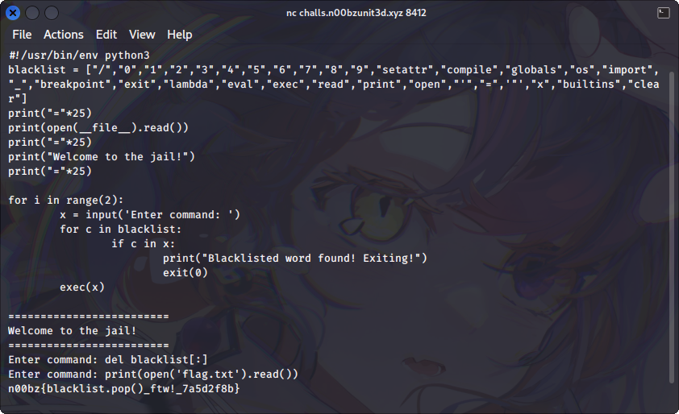

# Big Blacklist

## Deskripsi
That's a big blacklist for a pyjail challenge, don't you think? Author: NoobMaster

`nc challs.n00bzunit3d.xyz 8412`

## Solusi
Challenge ini merupakan sebuah pyjail atau restricted Python shell. Saat membuka challenge ini menggunakan netcat muncul tampilan seperti ini.

```
=========================
#!/usr/bin/env python3
blacklist = ["/","0","1","2","3","4","5","6","7","8","9","setattr","compile","globals","os","import","_","breakpoint","exit","lambda","eval","exec","read","print","open","'","=",'"',"x","builtins","clear"]
print("="*25)
print(open(__file__).read())
print("="*25)
print("Welcome to the jail!")
print("="*25)

for i in range(2):
        x = input('Enter command: ')
        for c in blacklist:
                if c in x:
                        print("Blacklisted word found! Exiting!")
                        exit(0)
        exec(x)

=========================
Welcome to the jail!
=========================
Enter command: 

```

Dari challenge tersebut diketahui beberapa kata yang masuk ke dalam blacklist.
Untuk menyelesaikan challenge ini dapat dengan cara menghapus seluruh isi dari blacklist yang berupa list dengan menggunakan `del blacklist[:]`.



## Flag
### n00bz{blacklist.pop()_ftw!_7a5d2f8b}