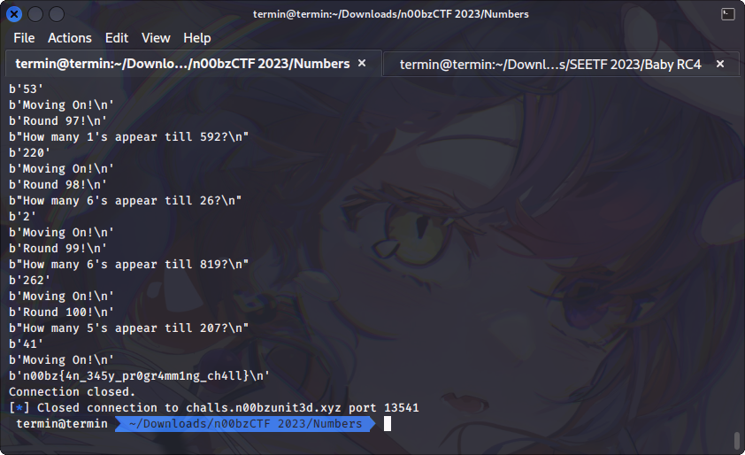

# Numbers

## Deskripsi
Welcome to numbers! just answer my few questions to get the flag!

Note: 
- To make this less confusing, I have an example. let's say if it asks - "How many 3's appear till 40?" The answer - 14 because ['3','13','23','30','31','32','33','33','34','35','36','37','38','39'].
- Also, the '33' is counted twice (not a typo!) as the three occurs two times (once in the 'ones' digit place and once in the 'tens' digit place)(each entry in that list is like `count++`). Author: NoobMaster

`nc challs.n00bzunit3d.xyz 13541`

## Solusi
Berdasarkan deskripsi soal kita perlu membuat sebuah program untuk menghitung banyaknya kemunculan sebuah angka x sampai angka y. Disini kemunculan angka x lebih dianggap sebagai sebuah string, karena pada deskripsi terlihat bahwa angka `33` dihitung sebagai kemunculan dua buah angka 3 (pada digit puluhan dan satuan).

Program di bawah ini akan menghitung berapa banyaknya kemunculan angka x tersebut.

```python
from pwn import *
import re

conn = remote("challs.n00bzunit3d.xyz", 13541)

try:
    def counter(dest, num):
        nums = []
        count = 0
        for i in range(1, dest):
            if str(num) in str(i):
                count += str(i).count(str(num))
        return count

    for i in range(1000):
        print(conn.recvline())
        rec = conn.recvline()
        print(rec)
        x = int(re.search(r"(\d+)'s", rec.decode()).group(1))
        y = int(re.search(r"till (\d+)", rec.decode()).group(1))

        res = str(counter(y, x)).encode('utf-8')
        print(res)
        conn.sendline(res)
        print(conn.recvline())

except EOFError:
    print("Connection closed.")

```



## Flag
### n00bz{4n_345y_pr0gr4mm1ng_ch4ll}