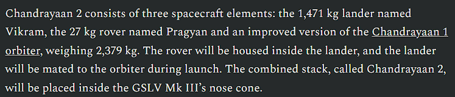
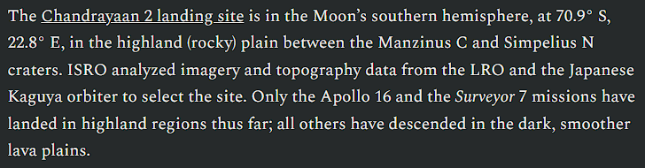

# Lost

## Deskripsi
A mission, had planned to land on the moon. Can you find where it planned to land on the moon and the name of the lander and rover? Flag is latitude longitude upto one decimal place.

- Note: Flag format - `n00bz{Lander_Rover_latitude_longitude} for eg - n00bz{Examplelander_Examplerover_12.3_45.6}`. Also note that flag is case sensitive!
- Note: Due to a quite big range of answers, to narrow down your search, use the latitude and longitude provided from this site: `blog.jatan.space` 

Author: NoobMaster

## Attachment
[mission moon](./Challenge/mission_moon.web)

## Solusi
Pada challenge ini diberikan suatu gambar wahana luar angkasa yang mendarat di bulan. Langkah pertama kita melakukan search menggunakan [Google Images](https://images.google.com/). Ketika kita memperhatikan note yang diberikan oleh probset, kita dapat melihat bahwa kita harus mengambil latitude dan longitude dari web `blog.jatan.space`, ternyata ketika kita melakukan image search dengan google, muncul web https://blog.jatan.space/p/isro-chandrayaan-2-moon-landing-mission. Ketika kita masuk ke dalam website tersebut, ternyata telah terdapat semua informasi yang dibutuhkan untuk mendapatkan flagnya. 

Lander dan Rover dapat ditemukan seperti pada gambar berikut:

Untuk titik koordinat longitude dan latitude dapat ditemukan seperti pada gambar berikut:

## Flag
### n00bz{Vikram_Pragyan_70.9_22.8}