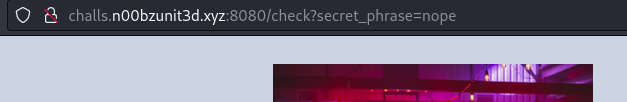
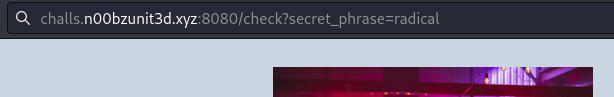
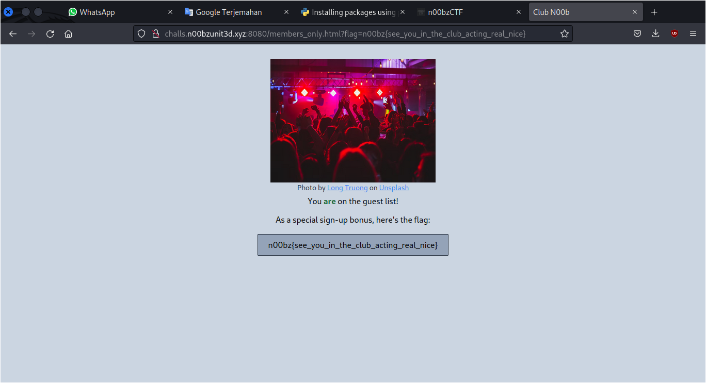

# Club_n00b

## Deskripsi
Can you get in the club? Author: 0xBlue

http://challs.n00bzunit3d.xyz:8080/ 

## Solusi
Tampilan dari website yang diberika seperti berikut ini.

Ketika button `Check Status` ditekan akan terdapat request dengan metode `GET` seperti berikut ini.

Terlihat bahwa web mengecek `secret_phase` menggunakan metode `GET` yang kita tahu bahwa value yang dikirimkan melalui metode `GET` akan ditampilkan pada url. 
Disini diasumsikan bahwa `secret_phase` yang benar adalah `radical` karena pada tampilan awal website menunjukkan kata ini di-highlight. Masukkan `radical` pada `secret_phase` seperti ini.

Setelah request dikirimkan didapat flag sebagai berikut

## Flag
### n00bz{see_you_in_the_club_acting_real_nice}